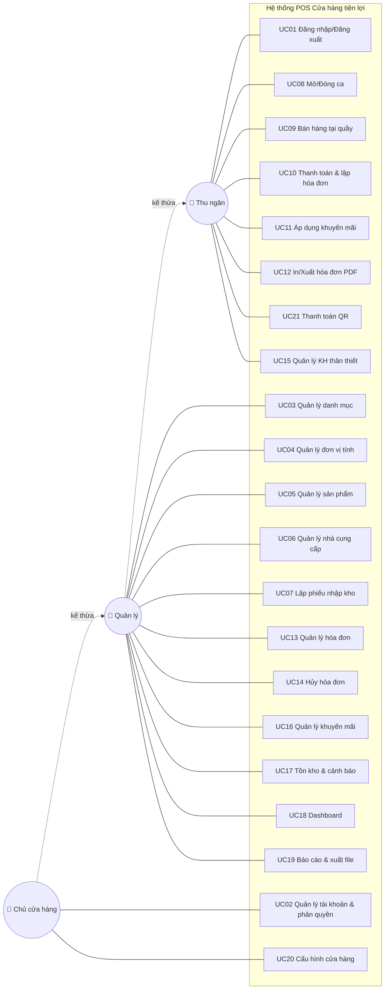
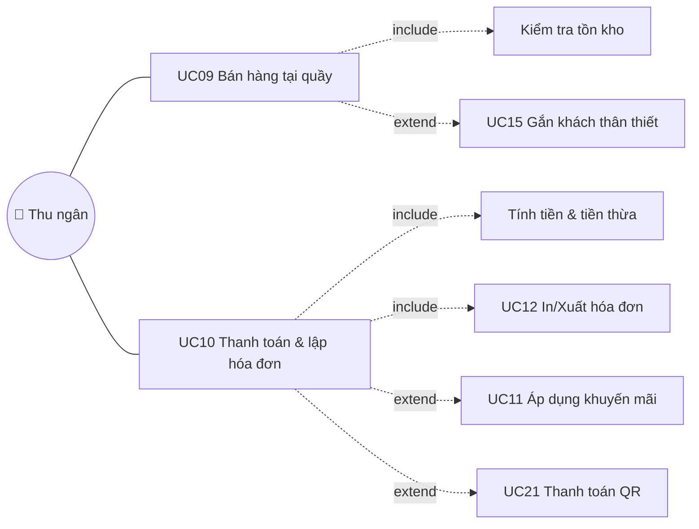
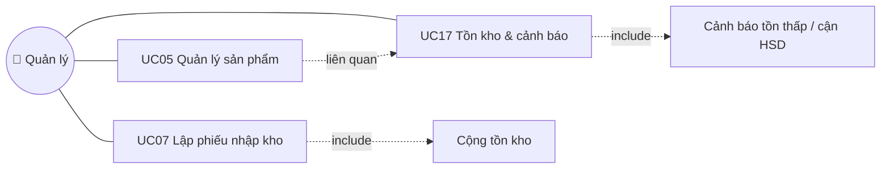

# 03. SƠ ĐỒ USE CASE

> Sơ đồ vẽ bằng **Mermaid** — xem trực tiếp trên VS Code (cài extension "Markdown Preview Mermaid Support")
> hoặc trên GitHub. Có thể export PNG để dán vào báo cáo.
> Quan hệ kế thừa actor: **Manager kế thừa Cashier**, **Admin kế thừa Manager** (ai quyền cao có luôn quyền thấp).

## 3.1. Sơ đồ Use Case tổng quát

## 3.2. Use Case con — Nghiệp vụ bán hàng (chi tiết quan hệ include/extend)

> **include**: luôn xảy ra (bán hàng luôn kiểm tra tồn; thanh toán luôn tính tiền & lập hóa đơn).
> **extend**: tùy chọn (gắn khách thân thiết, áp khuyến mãi, thanh toán QR).

## 3.3. Use Case con — Quản trị & kho

