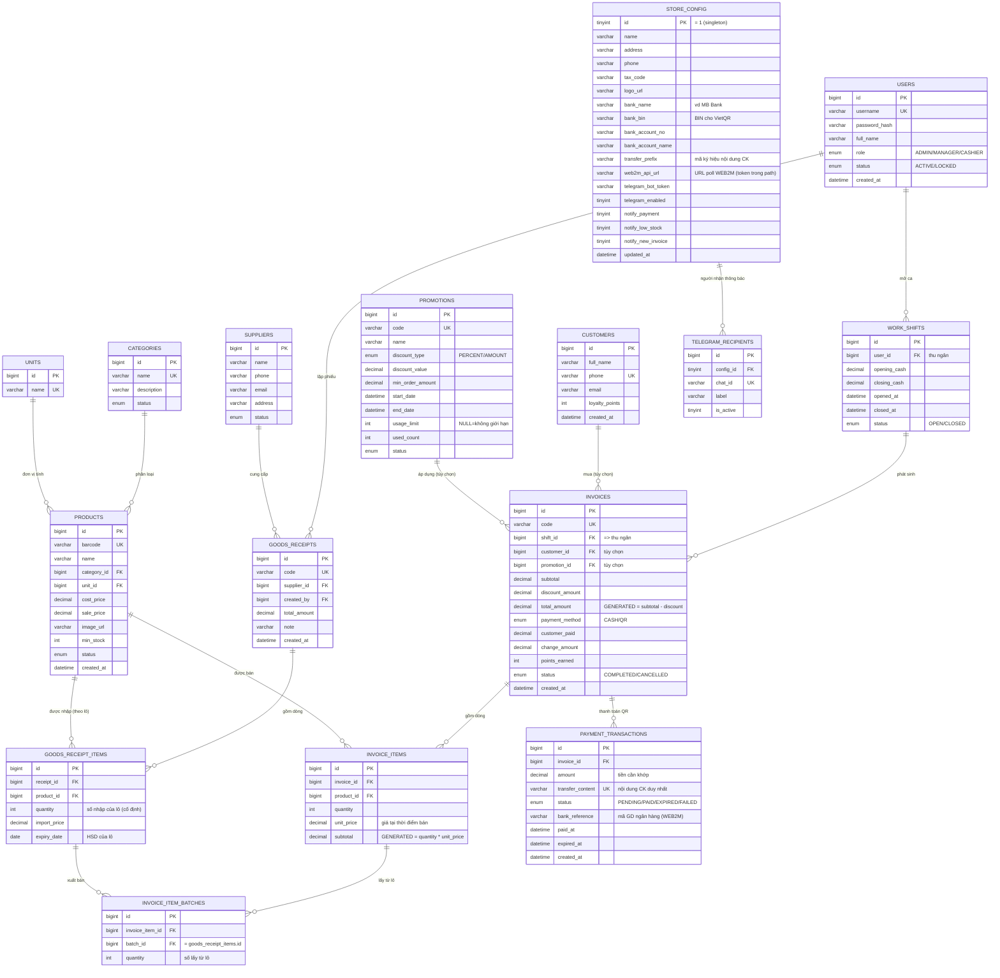

# 04. THIẾT KẾ CƠ SỞ DỮ LIỆU (ERD)

> Thiết kế **chuẩn hóa 3NF, toàn vẹn tham chiếu đầy đủ, không bảng/cột dư thừa**. Script đầy đủ
> (DDL + dữ liệu mẫu) ở [`../sql/schema.sql`](../sql/schema.sql) — đã **kiểm thử chạy thật trên
> MySQL 8.4.7**: tạo sạch **16 bảng + 7 view + 16 khóa ngoại**, không lỗi; đã test **hủy hóa đơn →
> tồn kho tự hoàn** và **không còn bảng nào đứng tách rời** (mọi bảng đều có quan hệ).
> Bao gồm tích hợp **VietQR** (hiển thị QR), **WEB2M** (poll đối soát ngân hàng), **Telegram Bot** (thông báo).

## 4.1. Nguyên tắc thiết kế & quy ước đặt tên

| Nguyên tắc | Áp dụng |
|------------|---------|
| Chuẩn hóa | Đạt **3NF**: mỗi bảng một thực thể, không phụ thuộc bắc cầu, không lặp nhóm |
| Khóa chính | `id BIGINT AUTO_INCREMENT` (đại diện - surrogate key) cho mọi bảng nghiệp vụ |
| Đặt tên bảng | `snake_case`, **số nhiều** (`products`, `invoices`) |
| Đặt tên cột | `snake_case`; khóa ngoại = `<bảng>_id` (`category_id`, `shift_id`) |
| Khóa ngoại | Đặt tên ràng buộc `fk_<bảng>_<đích>`; có `ON DELETE CASCADE` cho bảng chi tiết |
| Kiểu tiền tệ | `DECIMAL(12,2)` / `DECIMAL(14,2)` (không dùng FLOAT để tránh sai số) |
| Trạng thái cố định | Dùng `ENUM` (vai trò, trạng thái, hình thức thanh toán) |
| Toàn vẹn | `CHECK` cho số lượng/giá ≥ 0, ngày hợp lệ; `UNIQUE` cho mã vạch, SĐT, mã phiếu/HĐ |
| Bộ ký tự | `utf8mb4` (hỗ trợ tiếng Việt đầy đủ) |

## 4.2. Sơ đồ ERD tổng thể

> `STORE_CONFIG` là bảng cấu hình 1 dòng, không có quan hệ khóa ngoại nên đứng độc lập.

## 4.3. Bảng quan hệ & lực lượng (cardinality)

| # | Quan hệ | Lực lượng | Bắt buộc? | Diễn giải |
|---|---------|-----------|-----------|-----------|
| 1 | categories → products | 1 : N | có | Mỗi sản phẩm thuộc 1 danh mục |
| 2 | units → products | 1 : N | có | Mỗi sản phẩm có 1 đơn vị tính |
| 3 | suppliers → goods_receipts | 1 : N | có | Mỗi phiếu nhập từ 1 nhà cung cấp |
| 4 | users → goods_receipts | 1 : N | có | Người lập phiếu (`created_by`) |
| 5 | goods_receipts → goods_receipt_items | 1 : N | có | Phiếu nhập gồm nhiều dòng (lô) |
| 6 | products → goods_receipt_items | 1 : N | có | 1 sản phẩm nhập thành nhiều lô |
| 7 | users → work_shifts | 1 : N | có | 1 thu ngân có nhiều ca |
| 8 | work_shifts → invoices | 1 : N | có | Hóa đơn luôn thuộc 1 ca (⇒ thu ngân) |
| 9 | customers → invoices | 1 : N | **tùy chọn** | Khách thân thiết (có thể NULL) |
| 10 | promotions → invoices | 1 : N | **tùy chọn** | Mã giảm giá (có thể NULL) |
| 11 | invoices → invoice_items | 1 : N | có | Hóa đơn gồm nhiều dòng |
| 12 | products → invoice_items | 1 : N | có | 1 sản phẩm xuất hiện ở nhiều dòng HĐ |
| 13 | invoice_items → invoice_item_batches | 1 : N | có | 1 dòng bán lấy hàng từ ≥1 lô (FIFO) |
| 14 | goods_receipt_items → invoice_item_batches | 1 : N | có | 1 lô bị xuất bán ở nhiều lần |
| 15 | invoices → payment_transactions | 1 : N | tùy chọn | HĐ thanh toán QR có ≥1 lần đối soát |
| 16 | store_config → telegram_recipients | 1 : N | có | Danh sách Chat ID nhận thông báo |

> Quan hệ 13–14 là **bảng nối** `invoice_item_batches` (bán hàng ↔ lô tồn kho). Quan hệ 15 là
> giao dịch QR/WEB2M (chỉ HĐ thanh toán QR mới có). Quan hệ 16 nối danh sách người nhận Telegram
> về hub cấu hình.

### Về "bảng đứng một mình" (đã kiểm chứng lại)

Sau khi bổ sung, truy vấn `information_schema` cho thấy **KHÔNG còn bảng nào không có khóa ngoại**
(cả vào lẫn ra) — **toàn bộ 16 bảng đều có quan hệ**. `store_config` trước đây đứng riêng thì nay được
`telegram_recipients` tham chiếu.

Các bảng **gốc/master** (`users, categories, units, suppliers, customers, promotions`) chỉ có khóa
ngoại **đi vào** (được bảng khác tham chiếu) — đây là vai trò chuẩn của bảng danh mục, **vẫn được nối
và không hề dư thừa** (mỗi bảng đều được ít nhất 1 bảng khác sử dụng):

| Bảng gốc | Được tham chiếu bởi |
|----------|---------------------|
| users | goods_receipts, work_shifts |
| categories | products |
| units | products |
| suppliers | goods_receipts |
| customers | invoices |
| promotions | invoices |

## 4.4. Đặc tả chi tiết từng bảng

### `users` — Người dùng & phân quyền (FR1)
| Cột | Kiểu | Ràng buộc | Mô tả |
|-----|------|-----------|-------|
| id | BIGINT | PK, AI | Khóa chính |
| username | VARCHAR(50) | UNIQUE, NOT NULL | Tên đăng nhập |
| password_hash | VARCHAR(100) | NOT NULL | Mật khẩu **băm BCrypt** |
| full_name | VARCHAR(100) | NOT NULL | Họ tên |
| role | ENUM | NOT NULL | `ADMIN` / `MANAGER` / `CASHIER` |
| status | ENUM | DEFAULT `ACTIVE` | `ACTIVE` / `LOCKED` |
| created_at | DATETIME | DEFAULT now | Ngày tạo |

> **Chống thừa:** 3 vai trò cố định ⇒ dùng `ENUM` thay vì bảng `roles` gần như rỗng.

### `categories` — Danh mục (FR2.1)
| Cột | Kiểu | Ràng buộc | Mô tả |
|-----|------|-----------|-------|
| id | BIGINT | PK, AI | |
| name | VARCHAR(100) | UNIQUE, NOT NULL | Tên danh mục |
| description | VARCHAR(255) | | Mô tả |
| status | ENUM | DEFAULT `ACTIVE` | `ACTIVE` / `INACTIVE` |

### `units` — Đơn vị tính (FR2.2)
| Cột | Kiểu | Ràng buộc | Mô tả |
|-----|------|-----------|-------|
| id | BIGINT | PK, AI | |
| name | VARCHAR(50) | UNIQUE, NOT NULL | lon, chai, gói, thùng... |

### `products` — Sản phẩm (FR2.3)
| Cột | Kiểu | Ràng buộc | Mô tả |
|-----|------|-----------|-------|
| id | BIGINT | PK, AI | |
| barcode | VARCHAR(50) | UNIQUE, NOT NULL | Mã vạch |
| name | VARCHAR(150) | NOT NULL | Tên sản phẩm |
| category_id | BIGINT | FK→categories, NOT NULL | Danh mục |
| unit_id | BIGINT | FK→units, NOT NULL | Đơn vị tính |
| cost_price | DECIMAL(12,2) | ≥ 0 | Giá vốn hiện hành |
| sale_price | DECIMAL(12,2) | ≥ 0, NOT NULL | Giá bán |
| image_url | VARCHAR(255) | | Ảnh |
| min_stock | INT | ≥ 0 | Mức tồn tối thiểu (cảnh báo) |
| status | ENUM | DEFAULT `ACTIVE` | Bật/tắt kinh doanh |
| created_at | DATETIME | DEFAULT now | |

> **Chống thừa:** **không có cột `current_stock`** — tồn kho suy ra từ tồn các lô (view `v_product_stock`, dựa trên `v_batch_stock`).

### `suppliers` — Nhà cung cấp (FR3.1)
| Cột | Kiểu | Ràng buộc | Mô tả |
|-----|------|-----------|-------|
| id | BIGINT | PK, AI | |
| name | VARCHAR(150) | NOT NULL | Tên NCC |
| phone | VARCHAR(20) | | |
| email | VARCHAR(100) | | |
| address | VARCHAR(255) | | |
| status | ENUM | DEFAULT `ACTIVE` | |

### `goods_receipts` — Phiếu nhập kho (FR3.2)
| Cột | Kiểu | Ràng buộc | Mô tả |
|-----|------|-----------|-------|
| id | BIGINT | PK, AI | |
| code | VARCHAR(30) | UNIQUE, NOT NULL | Mã phiếu |
| supplier_id | BIGINT | FK→suppliers, NOT NULL | Nhà cung cấp |
| created_by | BIGINT | FK→users, NOT NULL | Người lập phiếu |
| total_amount | DECIMAL(14,2) | DEFAULT 0 | Tổng tiền chứng từ (chốt khi lưu) |
| note | VARCHAR(255) | | Ghi chú |
| created_at | DATETIME | DEFAULT now | |

### `goods_receipt_items` — Dòng phiếu nhập = **Lô hàng** (FR3.2, FR8)
| Cột | Kiểu | Ràng buộc | Mô tả |
|-----|------|-----------|-------|
| id | BIGINT | PK, AI | Cũng là `batch_id` |
| receipt_id | BIGINT | FK→goods_receipts (CASCADE), NOT NULL | Thuộc phiếu nào |
| product_id | BIGINT | FK→products, NOT NULL | Sản phẩm |
| quantity | INT | > 0 | **Số lượng nhập** của lô (cố định) |
| import_price | DECIMAL(12,2) | NOT NULL | Giá nhập tại thời điểm |
| expiry_date | DATE | nullable | **Hạn sử dụng** của lô |

> **Chống thừa:** dòng phiếu nhập đóng luôn vai trò **lô hàng** ⇒ không cần bảng `stock_batches` riêng.
> Lô là **bất biến** (không có cột `quantity_remaining`). Tồn còn lại = `quantity − tổng đã bán`
> (tính qua bảng nối `invoice_item_batches`, xem view `v_batch_stock`).
> `subtotal = quantity * import_price` **tính khi cần, không lưu**.

### `invoice_item_batches` — Phân bổ tồn theo lô khi bán (bảng nối)
| Cột | Kiểu | Ràng buộc | Mô tả |
|-----|------|-----------|-------|
| id | BIGINT | PK, AI | |
| invoice_item_id | BIGINT | FK→invoice_items (CASCADE), NOT NULL | Dòng bán nào |
| batch_id | BIGINT | FK→goods_receipt_items, NOT NULL | Lấy từ lô nào |
| quantity | INT | > 0 | Số lượng lấy từ lô này |

> **Vai trò:** cầu nối **bán hàng ↔ lô tồn kho** — chính là quan hệ còn thiếu trước đây.
> Bảo đảm: ① trừ tồn **FIFO truy vết được**; ② **hủy hóa đơn ⇒ tồn tự hoàn** (vì các dòng phân bổ
> trỏ tới hóa đơn `CANCELLED` không còn được cộng dồn — không cần cập nhật tồn thủ công).
> Ràng buộc nghiệp vụ: `SUM(quantity theo invoice_item) = invoice_items.quantity`.

### `customers` — Khách hàng thân thiết (FR6)
| Cột | Kiểu | Ràng buộc | Mô tả |
|-----|------|-----------|-------|
| id | BIGINT | PK, AI | |
| full_name | VARCHAR(100) | NOT NULL | Họ tên |
| phone | VARCHAR(20) | UNIQUE, NOT NULL | **SĐT duy nhất** |
| email | VARCHAR(100) | | |
| loyalty_points | INT | ≥ 0 | Số dư điểm tích lũy |
| created_at | DATETIME | DEFAULT now | |

> **Chống thừa:** `total_spent` (tổng chi tiêu) **không lưu** ⇒ view `v_customer_spending`.

### `promotions` — Khuyến mãi / Mã giảm giá (FR7)
| Cột | Kiểu | Ràng buộc | Mô tả |
|-----|------|-----------|-------|
| id | BIGINT | PK, AI | |
| code | VARCHAR(30) | UNIQUE, NOT NULL | Mã giảm giá |
| name | VARCHAR(150) | NOT NULL | Tên chương trình |
| discount_type | ENUM | NOT NULL | `PERCENT` / `AMOUNT` |
| discount_value | DECIMAL(12,2) | ≥ 0 | Giá trị giảm |
| min_order_amount | DECIMAL(12,2) | DEFAULT 0 | Đơn tối thiểu |
| start_date / end_date | DATETIME | end ≥ start | Thời gian hiệu lực |
| usage_limit | INT | nullable | Giới hạn lượt (NULL = không giới hạn) |
| used_count | INT | ≥ 0 | Lượt đã dùng (tăng khi áp dụng - FR4.7) |
| status | ENUM | DEFAULT `ACTIVE` | |

### `work_shifts` — Ca làm việc (FR4.1)
| Cột | Kiểu | Ràng buộc | Mô tả |
|-----|------|-----------|-------|
| id | BIGINT | PK, AI | |
| user_id | BIGINT | FK→users, NOT NULL | Thu ngân của ca |
| opening_cash | DECIMAL(12,2) | DEFAULT 0 | Tiền đầu ca |
| closing_cash | DECIMAL(12,2) | nullable | Tiền đối soát cuối ca |
| opened_at | DATETIME | DEFAULT now | Giờ mở ca |
| closed_at | DATETIME | nullable | Giờ đóng ca |
| status | ENUM | DEFAULT `OPEN` | `OPEN` / `CLOSED` |

> **Chống thừa:** doanh thu ca **không lưu** ⇒ view `v_shift_summary` (`SUM` hóa đơn của ca).

### `invoices` — Hóa đơn (FR4, FR5)
| Cột | Kiểu | Ràng buộc | Mô tả |
|-----|------|-----------|-------|
| id | BIGINT | PK, AI | |
| code | VARCHAR(30) | UNIQUE, NOT NULL | Mã hóa đơn |
| shift_id | BIGINT | FK→work_shifts, NOT NULL | Ca làm việc ⇒ suy ra thu ngân |
| customer_id | BIGINT | FK→customers, nullable | Khách thân thiết (tùy chọn) |
| promotion_id | BIGINT | FK→promotions, nullable | Mã giảm giá (tùy chọn) |
| subtotal | DECIMAL(14,2) | ≥ 0 | Tổng trước giảm (chốt từ chi tiết) |
| discount_amount | DECIMAL(14,2) | ≥ 0 | Số tiền giảm |
| total_amount | DECIMAL(14,2) | **GENERATED STORED** | `= subtotal - discount_amount` |
| payment_method | ENUM | NOT NULL | `CASH` / `QR` |
| customer_paid | DECIMAL(14,2) | nullable | Tiền khách đưa (tiền mặt) |
| change_amount | DECIMAL(14,2) | nullable | Tiền thừa |
| points_earned | INT | DEFAULT 0 | Điểm tích cho khách ở HĐ này |
| status | ENUM | DEFAULT `COMPLETED` | `COMPLETED` / `CANCELLED` |
| created_at | DATETIME | DEFAULT now | |

> **Chống thừa:** **không có cột `cashier_id`** — thu ngân suy ra qua `shift_id → work_shifts.user_id`
> (loại bỏ FK bắc cầu). `total_amount` là **cột GENERATED** do CSDL tự tính.

### `invoice_items` — Chi tiết hóa đơn (FR4.3)
| Cột | Kiểu | Ràng buộc | Mô tả |
|-----|------|-----------|-------|
| id | BIGINT | PK, AI | |
| invoice_id | BIGINT | FK→invoices (CASCADE), NOT NULL | Thuộc hóa đơn |
| product_id | BIGINT | FK→products, NOT NULL | Sản phẩm |
| quantity | INT | > 0 | Số lượng |
| unit_price | DECIMAL(12,2) | NOT NULL | **Giá bán tại thời điểm** (snapshot) |
| subtotal | DECIMAL(14,2) | **GENERATED STORED** | `= quantity * unit_price` |

> **Vì sao lưu `unit_price` riêng (không lấy từ `products.sale_price`)?** Giá bán thay đổi theo thời gian;
> hóa đơn phải giữ **giá lịch sử** đúng lúc bán. Đây là dữ liệu **theo thời điểm**, không phải dư thừa.

### `payment_transactions` — Giao dịch thanh toán điện tử (FR-A1, FR-A4)
| Cột | Kiểu | Ràng buộc | Mô tả |
|-----|------|-----------|-------|
| id | BIGINT | PK, AI | |
| invoice_id | BIGINT | FK→invoices (CASCADE), NOT NULL | Thanh toán cho hóa đơn nào |
| amount | DECIMAL(14,2) | ≥ 0 | Số tiền cần khớp với giao dịch ngân hàng |
| transfer_content | VARCHAR(50) | UNIQUE, NOT NULL | Nội dung CK **duy nhất** để WEB2M đối soát |
| status | ENUM | DEFAULT `PENDING` | `PENDING`/`PAID`/`EXPIRED`/`FAILED` |
| bank_reference | VARCHAR(100) | nullable | Mã giao dịch NH do WEB2M trả về khi khớp |
| paid_at | DATETIME | nullable | Thời điểm xác nhận đã nhận tiền |
| expired_at | DATETIME | nullable | Hạn hiệu lực mã QR |
| created_at | DATETIME | DEFAULT now | |

> Chỉ tạo dòng cho thanh toán **QR/chuyển khoản** (tiền mặt đã thu tại quầy). `amount` là **snapshot**
> số tiền cần đối soát; `transfer_content` (vd `POS <mã HĐ>`) là khóa để WEB2M map giao dịch ngân hàng
> về đúng hóa đơn — mỗi cột có vai trò riêng, không dư thừa.

### `telegram_recipients` — Người nhận thông báo Telegram (FR-A5)
| Cột | Kiểu | Ràng buộc | Mô tả |
|-----|------|-----------|-------|
| id | BIGINT | PK, AI | |
| config_id | TINYINT | FK→store_config, NOT NULL | Nối về hub cấu hình |
| chat_id | VARCHAR(50) | UNIQUE, NOT NULL | ID số hoặc `@username` kênh |
| label | VARCHAR(100) | nullable | Ghi chú người nhận |
| is_active | TINYINT(1) | DEFAULT 1 | Bật/tắt nhận thông báo |

> Tách bảng để giữ **1NF** (mỗi Chat ID một dòng, thêm/xóa linh hoạt) thay vì nhồi danh sách vào 1 cột.

### `store_config` — Cấu hình hệ thống (hub: FR10 + FR-A)
| Cột | Kiểu | Ràng buộc | Mô tả |
|-----|------|-----------|-------|
| id | TINYINT | PK, CHECK = 1 | Bảng 1 dòng (singleton) |
| name / address / phone / tax_code / logo_url | VARCHAR | | Thông tin cửa hàng (in hóa đơn) |
| bank_name / bank_bin | VARCHAR | | Ngân hàng + BIN để **sinh VietQR** |
| bank_account_no / bank_account_name | VARCHAR | | Tài khoản nhận tiền |
| transfer_prefix | VARCHAR(20) | | Mã ký hiệu trong nội dung CK (vd `POS`) |
| web2m_api_url | VARCHAR(255) | | URL API WEB2M poll giao dịch (token trong path) — **nhạy cảm** |
| telegram_bot_token | VARCHAR(255) | | Token bot Telegram — **nhạy cảm** |
| telegram_enabled | TINYINT(1) | DEFAULT 0 | Bật/tắt thông báo Telegram |
| notify_payment / notify_low_stock / notify_new_invoice | TINYINT(1) | | Bật/tắt từng loại thông báo |
| updated_at | DATETIME | nullable | Lần cập nhật cấu hình |

> **Bảo mật:** `web2m_api_url` & `telegram_bot_token` là thông tin **nhạy cảm** — hạn chế quyền đọc,
> production nên override bằng **biến môi trường** trong `application.yml` thay vì để lộ trong DB/Git.
> Dữ liệu mẫu trong `schema.sql` chỉ là **placeholder giả** (`YOUR_WEB2M_TOKEN`, `YOUR_TELEGRAM_BOT_TOKEN`).

## 4.5. Phân tích chuẩn hóa & quyết định chống dư thừa

| Quyết định | Loại bỏ điều gì | Lý do (đạt chuẩn hóa) |
|------------|-----------------|------------------------|
| Không cột `products.current_stock` | Trùng dữ liệu tổng tồn | Tồn = `SUM` tồn các lô → 1 nguồn sự thật |
| Dòng phiếu nhập = lô hàng | Bảng `stock_batches` + cột HSD lặp | Gộp thực thể "lô" vào dòng phiếu, không thừa bảng |
| Lô **bất biến**, bỏ `quantity_remaining` | Cache tồn dễ lệch | Tồn = `quantity − tổng đã bán` qua `invoice_item_batches` |
| Bảng nối `invoice_item_batches` | (thêm có chủ đích) | **Toàn vẹn**: nối bán↔lô, hủy HĐ tự hoàn tồn |
| Không cột `invoices.cashier_id` | FK bắc cầu (3NF) | Thu ngân xác định qua `shift_id` |
| `subtotal`, `total_amount` GENERATED | Cột tính tay dễ sai | CSDL tự tính, đảm bảo nhất quán |
| `total_spent`, `total_sales` → VIEW | Cột tổng dư thừa | Tổng hợp khi truy vấn, không lưu |
| `role` ENUM | Bảng `roles` rỗng | 3 vai trò cố định, tra cứu nhanh |
| `unit_price` snapshot trên HĐ | (giữ lại có chủ đích) | Dữ liệu lịch sử, **không** phải dư thừa |

- **1NF:** mọi cột nguyên tử, không nhóm lặp (chi tiết tách thành `*_items`).
- **2NF:** mọi bảng có khóa chính đơn `id`; thuộc tính phụ thuộc đầy đủ vào khóa.
- **3NF:** không phụ thuộc bắc cầu (đã loại `cashier_id`, các cột tổng).

## 4.6. Chỉ mục (Index) phục vụ hiệu năng (NFR1)

| Bảng | Index | Mục đích |
|------|-------|----------|
| products | `barcode` (UNIQUE), `name`, `category_id`, `unit_id` | Tra cứu POS theo mã vạch < 1s, tìm theo tên/lọc |
| goods_receipt_items | `product_id`, `expiry_date` | Tính tồn theo SP, quét HSD |
| invoice_item_batches | `invoice_item_id`, `batch_id` | Tính tồn lô, truy vết phân bổ |
| invoices | `shift_id`, `customer_id`, `created_at` | Báo cáo theo ca/khách/ngày |
| invoice_items | `invoice_id`, `product_id` | Lấy chi tiết HĐ, thống kê bán chạy |
| work_shifts | `user_id`, `status` | Tìm ca đang mở của thu ngân |
| customers | `phone` (UNIQUE) | Tra khách theo SĐT |

## 4.7. View (suy ra tồn kho & các tổng — thay cột dư thừa)

| View | Phục vụ | Nội dung |
|------|---------|----------|
| `v_batch_stock` | FR8 | Tồn còn lại **từng lô** = `quantity − tổng đã bán (HĐ COMPLETED)` |
| `v_product_stock` | FR8.1 | Tồn kho hiện tại từng sản phẩm (tổng tồn các lô) |
| `v_low_stock` | FR8.2 | Sản phẩm tồn ≤ mức tối thiểu |
| `v_expiring_batches` | FR8.2 | Lô còn hàng & HSD trong 30 ngày tới |
| `v_customer_spending` | FR6.2 | Tổng chi tiêu + số HĐ của khách |
| `v_shift_summary` | FR9.2 | Doanh thu + số HĐ theo ca/thu ngân |
| `v_pending_payments` | FR-A4 | Giao dịch QR đang chờ WEB2M đối soát |

## 4.8. Toàn vẹn giao dịch (NFR5)

Các nghiệp vụ ghi nhiều bảng phải nằm trong **một transaction** (Spring `@Transactional`):
- **Bán hàng (UC10):** lưu `invoices` + `invoice_items`, **chọn lô FIFO theo HSD** rồi ghi
  `invoice_item_batches` (phân bổ số lượng từng lô), cộng `loyalty_points`, tăng `promotions.used_count`.
  Nếu một sản phẩm không đủ tồn → **rollback** toàn bộ.
- **Hủy hóa đơn (UC14):** chỉ cần đặt `invoices.status = 'CANCELLED'` → tồn kho **tự hoàn** (các dòng
  `invoice_item_batches` của HĐ này không còn được tính trong `v_batch_stock`), hoàn `loyalty_points` &
  `used_count`. **Không** sửa tồn thủ công ⇒ không sợ lệch dữ liệu.
- **Nhập kho (UC07):** lưu `goods_receipts` + `goods_receipt_items` (tạo lô mới), cập nhật `cost_price`
  (tùy chọn). Lỗi bất kỳ → rollback.

> Đã **kiểm thử thực tế**: bán 2 Trà xanh + 1 Mì → tồn lô giảm đúng (48→46, 60→59); đặt HĐ
> `CANCELLED` → tồn tự hoàn về 48 và 60. Toàn vẹn tồn kho được CSDL bảo đảm bằng quan hệ, không
> phụ thuộc code cập nhật tay.

## 4.9. Luồng thanh toán QR tự động (VietQR + WEB2M + Telegram)

Phân vai rõ ràng — **VietQR** chỉ hiển thị, **WEB2M** mới là API đối soát:

1. **Thanh toán QR (UC10/UC21):** sau khi lưu hóa đơn (status `COMPLETED`), tạo `payment_transactions`
   (`status='PENDING'`, `transfer_content = '<transfer_prefix> <mã HĐ>'`).
2. **VietQR (FR-A1):** backend dựng **URL ảnh QR** từ `store_config` (bank_bin, account_no, account_name)
   + số tiền + `transfer_content` → frontend hiển thị cho khách quét. **Không lưu QR** (sinh khi cần).
3. **WEB2M (FR-A4):** job định kỳ gọi `web2m_api_url` lấy lịch sử giao dịch ngân hàng; khớp giao dịch
   theo **số tiền + nội dung CK** chứa `transfer_content` ⇒ cập nhật `payment_transactions`
   (`status='PAID'`, `bank_reference`, `paid_at`).
4. **Telegram (FR-A5):** nếu `telegram_enabled` và `notify_payment` → gửi thông báo tới mọi
   `telegram_recipients` đang `is_active` qua `telegram_bot_token`.

> Tiền mặt không đi qua luồng này. Nếu QR quá hạn chưa nhận tiền → đặt `EXPIRED` hoặc hủy HĐ (tự hoàn tồn).
