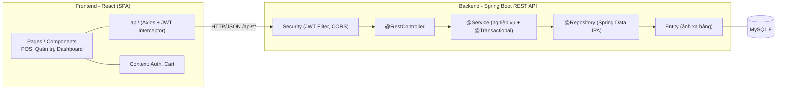
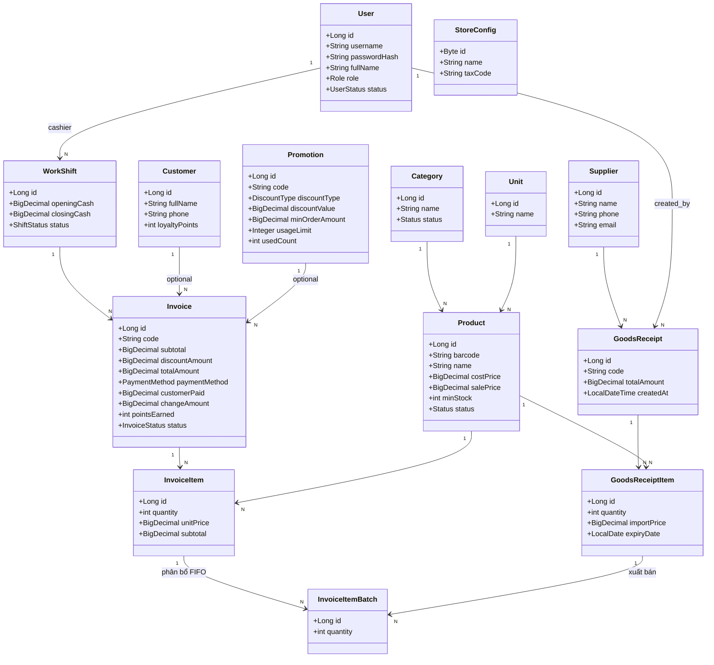
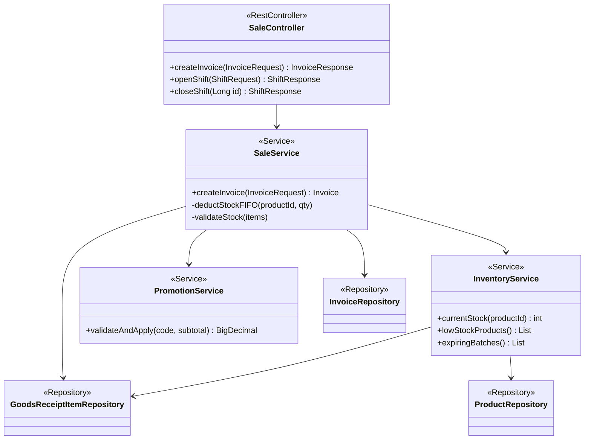
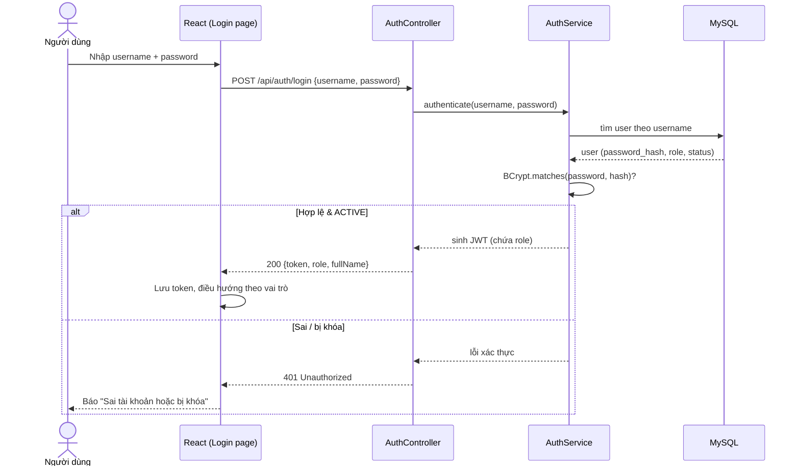
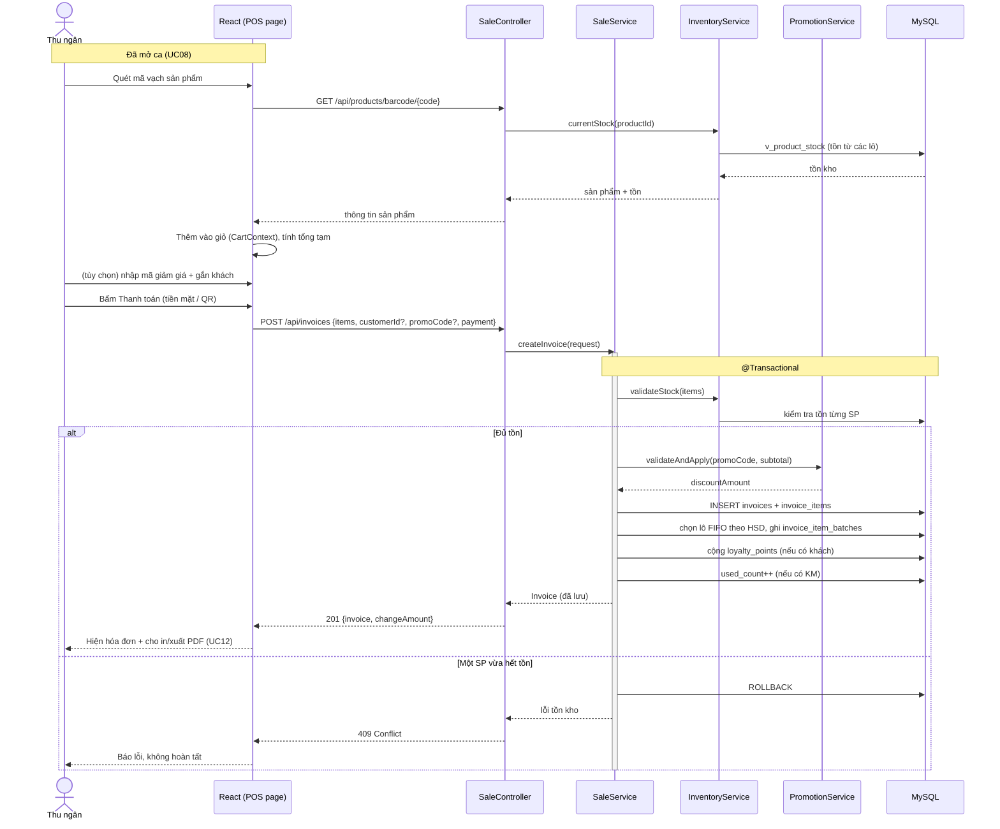
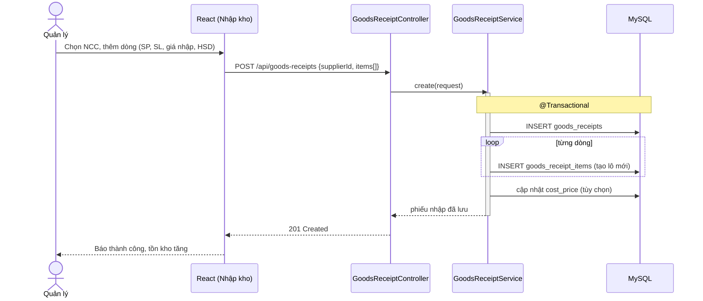
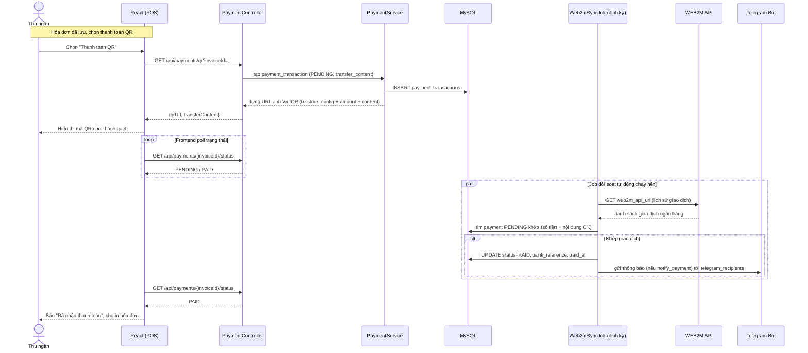
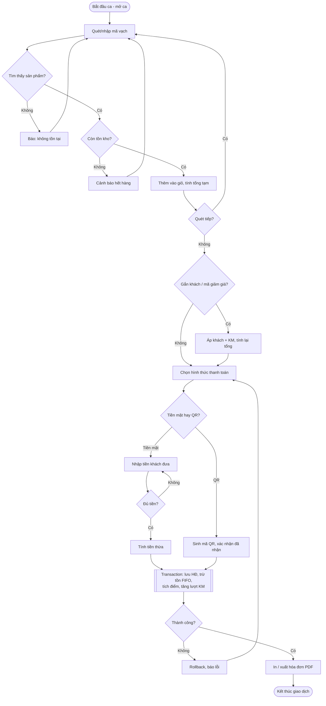
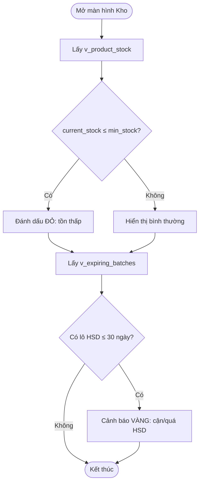

# 05. THIẾT KẾ UML

> Sơ đồ vẽ bằng **Mermaid**. Hệ thống gồm **Frontend React (SPA)** gọi **Backend Spring Boot REST API**
> qua HTTP/JSON; backend phân lớp **Controller → Service → Repository → Entity** trên **MySQL**.

## 5.1. Sơ đồ kiến trúc tổng thể (Component)

## 5.2. Class Diagram — Tầng Domain (Entity)

> Phản ánh đúng CSDL ở `04`. Quan hệ kết hợp đúng theo khóa ngoại (1—N).

> `InvoiceItemBatch` là **bảng nối** giữa dòng bán và lô hàng — bảo đảm truy vết & toàn vẹn tồn kho
> (hủy hóa đơn ⇒ tồn tự hoàn).

## 5.3. Class Diagram — Tầng nghiệp vụ (ví dụ module Bán hàng)

## 5.4. Sequence Diagram — UC01 Đăng nhập (JWT)

## 5.5. Sequence Diagram — UC09 + UC10 Bán hàng & Thanh toán (trọng tâm)

## 5.6. Sequence Diagram — UC07 Lập phiếu nhập kho

## 5.6b. Sequence Diagram — Thanh toán QR + đối soát WEB2M + Telegram (UC21/UC22/UC23)

> **VietQR** chỉ hiển thị mã QR; **WEB2M** poll giao dịch ngân hàng để xác nhận; **Telegram** báo kết quả.

## 5.7. Activity Diagram — Luồng bán hàng tại quầy

## 5.8. Activity Diagram — Cảnh báo tồn kho & HSD (UC17)

