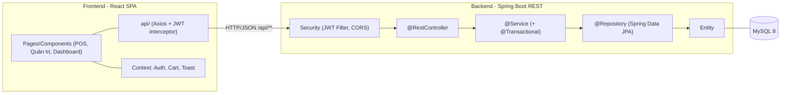
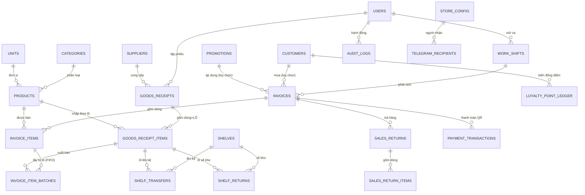
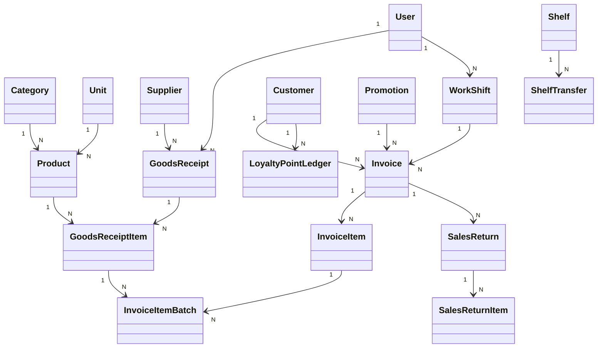
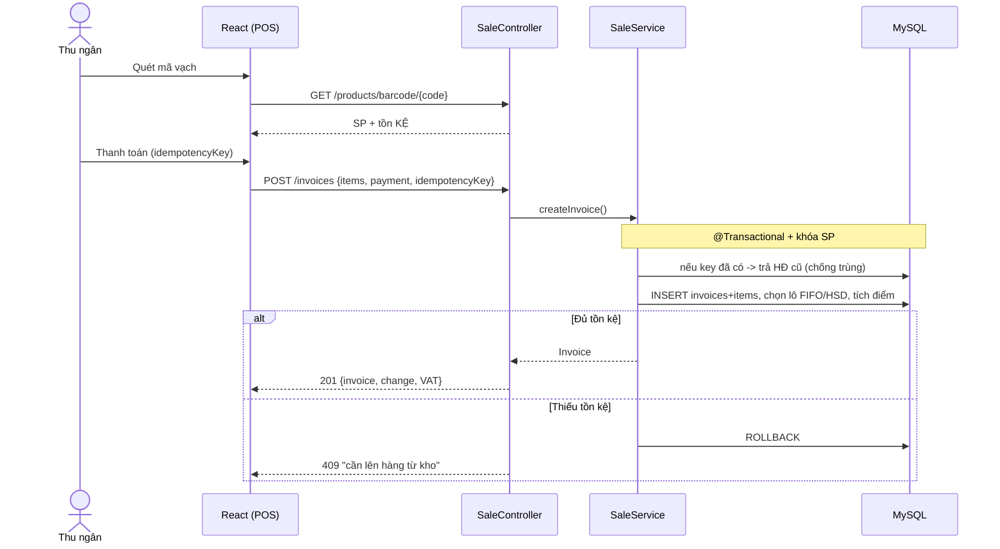

# BÁO CÁO ĐỒ ÁN — WEBSITE POS CHO CỬA HÀNG TIỆN LỢI

> **Đề tài số 10** — Hệ thống POS (Point of Sale) cho cửa hàng tiện lợi (MiniMart POS).
> Đồ án **cá nhân**: thực hiện toàn bộ phân tích → thiết kế → lập trình (Frontend React +
> Backend Spring Boot REST + MySQL) → kiểm thử → triển khai.
> **Đây là tài liệu CHÍNH THỨC DUY NHẤT** (đã gộp toàn bộ tài liệu rời trước đây).

---

## MỤC LỤC
1. [Tổng quan & bài toán](#1-tổng-quan--bài-toán)
2. [Công nghệ sử dụng](#2-công-nghệ-sử-dụng)
3. [Phân tích yêu cầu (SRS)](#3-phân-tích-yêu-cầu-srs)
4. [Use Case](#4-use-case)
5. [Thiết kế kiến trúc](#5-thiết-kế-kiến-trúc)
6. [Thiết kế cơ sở dữ liệu (ERD)](#6-thiết-kế-cơ-sở-dữ-liệu-erd)
7. [Thiết kế UML](#7-thiết-kế-uml)
8. [Phân quyền theo vai trò](#8-phân-quyền-theo-vai-trò)
9. [Đặc tả REST API](#9-đặc-tả-rest-api)
10. [Nghiệp vụ chi tiết & tính năng nâng cao](#10-nghiệp-vụ-chi-tiết--tính-năng-nâng-cao)
11. [Toàn vẹn dữ liệu & các bài toán logic/toán](#11-toàn-vẹn-dữ-liệu--các-bài-toán-logictoán)
12. [Bảo mật](#12-bảo-mật)
13. [Triển khai & demo](#13-triển-khai--demo)
14. [Kiểm thử (QA)](#14-kiểm-thử-qa)
15. [Đối chiếu tiêu chí chấm điểm](#15-đối-chiếu-tiêu-chí-chấm-điểm)
16. [Kết luận & hướng phát triển](#16-kết-luận--hướng-phát-triển)

---

## 1. Tổng quan & bài toán

Cửa hàng tiện lợi có **số mặt hàng lớn**, **tần suất giao dịch cao**, nhiều hàng có **hạn sử dụng (HSD)**,
nhiều **ca/thu ngân** trong ngày. Quản lý thủ công (sổ sách/Excel) gây: tính tiền chậm & dễ sai, không nắm
**tồn kho thực tế**, dễ tồn hàng cận/quá hạn, khó tổng hợp **doanh thu**, không quản lý được **khách thân thiết**.

**Mục tiêu:** website POS giúp thu ngân **bán hàng nhanh bằng quét mã vạch** (tự tính tiền – tồn kho – hóa đơn);
giúp quản lý **kiểm soát kho, doanh thu, nhân viên, khách hàng** theo thời gian thực.

| Mục | Nội dung |
|---|---|
| Tên hệ thống | Website POS cho cửa hàng tiện lợi (MiniMart POS) |
| Kiến trúc | Client–Server tách lớp: **React SPA ↔ REST API (Spring Boot) ↔ MySQL** |
| Hình thức | Đồ án cá nhân — toàn bộ FE + BE + CSDL + tài liệu |

**Phạm vi:** Trong phạm vi — bán hàng quầy (POS) + quét mã vạch, quản lý SP/danh mục/đơn vị/NCC, nhập kho,
**kho ↔ kệ (lên kệ/về kho)**, tồn kho + cảnh báo HSD, hóa đơn, **trả hàng/hoàn tiền**, khách thân thiết + tích điểm,
khuyến mãi, **VAT**, ca làm việc, phân quyền, dashboard, báo cáo, tích hợp QR/PDF/Telegram.
Ngoài phạm vi — bán online/giao hàng, đa chi nhánh, kế toán công nợ chi tiết.

---

## 2. Công nghệ sử dụng

| Tầng | Công nghệ |
|---|---|
| Frontend | **React 18 (Vite, Bun)**, React Router, React-Bootstrap, **Recharts**, Axios, Context API |
| Backend | **Java 17, Spring Boot 3** (Web, Data JPA, Security), JWT, BCrypt, Bean Validation |
| CSDL | **MySQL 8** (ServBay/phpMyAdmin), JPA/Hibernate |
| Tích hợp | **VietQR** (hiển thị QR), **WEB2M** (đối soát ngân hàng), **Telegram Bot**, **OpenPDF** (hóa đơn 80mm), **Apache POI** (Excel) |
| Khác | Maven, Git (commit theo từng chức năng) |

Backend phân lớp **Controller → Service → Repository → Entity**; Frontend SPA gọi REST `/api/**` qua Axios + JWT.

---

## 3. Phân tích yêu cầu (SRS)

### 3.1. Tác nhân (Actor)

| Actor | Vai trò |
|---|---|
| **Chủ cửa hàng (Admin)** | Toàn quyền + quản lý tài khoản + cấu hình hệ thống + nhật ký kiểm toán |
| **Quản lý (Manager)** | Sản phẩm/giá, kho, nhập hàng, cấu hình kệ, khuyến mãi, hủy & trả hàng, báo cáo, quản lý ca |
| **Thu ngân (Cashier)** | Bán hàng POS, ca làm việc, khách hàng, **thao tác kệ (lên kệ/về kho)** |
| **Hệ thống (System)** | Cảnh báo tồn/HSD, đối soát WEB2M, gửi Telegram, tích điểm, sinh mã |

> Khách mua hàng không trực tiếp dùng hệ thống (giao dịch qua thu ngân) → không phải actor đăng nhập.

### 3.2. Yêu cầu chức năng (FR)

- **FR1 Xác thực & phân quyền:** đăng nhập (mật khẩu băm), phân quyền 3 vai trò, Admin quản lý tài khoản.
- **FR2 Danh mục & sản phẩm:** CRUD danh mục, đơn vị, sản phẩm (barcode, giá vốn/bán, **thuế suất**, **quy cách đóng gói**, tồn tối thiểu); tìm/lọc.
- **FR3 Nhà cung cấp & nhập kho:** CRUD NCC; phiếu nhập nhiều dòng theo lô (số lượng, giá nhập, HSD, **nhập theo thùng→quy đổi**); tự tăng tồn.
- **FR4 Bán hàng POS (trọng tâm):** mở/đóng ca; quét mã vạch; giỏ hàng; gắn khách + áp KM + đổi điểm; thanh toán tiền mặt/QR; lưu hóa đơn (transaction) trừ tồn **FIFO theo HSD**, tích điểm; in PDF.
- **FR5 Hóa đơn & lịch sử:** xem/lọc; hủy hóa đơn (có lý do); **trả hàng/hoàn tiền** từng phần.
- **FR6 Khách thân thiết:** CRUD; tích/đổi điểm; **sổ cái điểm**; lịch sử mua.
- **FR7 Khuyến mãi:** CRUD; kiểm tra hợp lệ khi áp dụng.
- **FR8 Kho & kệ:** tồn kho tách **KHO/KỆ**; **lên kệ / về kho**; **cấu hình kệ vật lý**; cảnh báo tồn thấp & HSD; **đề xuất nhập hàng** (tồn an toàn); **phân tích ABC/XYZ**.
- **FR9 Dashboard & báo cáo:** KPI + biểu đồ; doanh thu/lợi nhuận theo ngày/tuần/tháng/năm (**ròng — trừ hàng trả**); xuất Excel.
- **FR10 Cấu hình cửa hàng:** thông tin in hóa đơn, ngân hàng, tích hợp.
- **FR-A Nâng cao:** VietQR, đối soát WEB2M (job nền), Telegram, PDF, **VAT**, **audit log**, chống thu tiền 2 lần (idempotency).

### 3.3. Yêu cầu phi chức năng (NFR)

| Mã | Yêu cầu |
|---|---|
| NFR1 Hiệu năng | Tra mã vạch < 1s; thao tác POS mượt khi đông |
| NFR2 Khả dụng | POS tối giản, **thao tác bằng phím/máy quét**, ít click |
| NFR3 Tương thích | Responsive (Chrome/Edge, tablet) |
| NFR4 Bảo mật | BCrypt + JWT, phân quyền backend, CORS, chống SQLi/XSS, **chống brute-force**, **audit log** |
| NFR5 Toàn vẹn | FK/CHECK/UNIQUE; **transaction**; **khóa bi quan** chống bán âm; idempotency |
| NFR6 Tin cậy | Validate 2 phía; thông báo lỗi rõ; ẩn lỗi nội bộ |
| NFR7 Bảo trì | Phân lớp rõ, đặt tên thống nhất, component dùng chung |
| NFR8 Triển khai | **Tự tạo + seed CSDL** khi khởi động; chạy đơn giản |

---

## 4. Use Case

24 use case chính: UC01 Đăng nhập · UC02 Quản lý tài khoản · UC03–06 CRUD danh mục/đơn vị/sản phẩm/NCC ·
UC07 Nhập kho · UC08 Mở/đóng ca · **UC09 Bán hàng** · **UC10 Thanh toán & lập hóa đơn** · UC11 Áp khuyến mãi ·
UC12 In hóa đơn PDF · UC13 Quản lý hóa đơn · UC14 Hủy hóa đơn · UC15 Khách thân thiết · UC16 Khuyến mãi ·
UC17 Tồn kho & cảnh báo · UC18 Dashboard · UC19 Báo cáo · UC20 Cấu hình · UC21 QR · UC22 Đối soát WEB2M ·
UC23 Telegram · UC24 Cấu hình tích hợp. **Bổ sung:** UC25 Lên kệ/Về kho · UC26 Cấu hình kệ · UC27 Trả hàng ·
UC28 Phân tích ABC/XYZ · UC29 Xem nhật ký kiểm toán.

**Quan hệ kế thừa actor:** Admin ⊃ Manager ⊃ Cashier (quyền cao có luôn quyền thấp).

### UC09 — Bán hàng tại quầy
- **Tiền điều kiện:** đã đăng nhập + **đã mở ca**.
- **Luồng chính:** mở POS → quét mã vạch → kiểm tra **tồn trên kệ** → thêm giỏ + tính tổng → (tùy chọn) gắn khách/KM → thanh toán.
- **Ngoại lệ:** không thấy mã → báo; **hết hàng trên kệ** → "cần lên hàng từ kho".

### UC10 — Thanh toán & lập hóa đơn
- **Hậu điều kiện:** hóa đơn lưu; tồn kệ giảm; điểm khách tăng; doanh thu ca tăng.
- **Luồng:** chọn thanh toán → tiền mặt (nhập tiền khách → tính thừa) / QR (sinh VietQR) → **transaction** lưu HĐ + chi tiết + phân bổ lô FIFO + tích điểm + tăng lượt KM. Thiếu tồn → **rollback**.

### UC27 — Trả hàng (mới)
- **Tiền điều kiện:** HĐ gốc COMPLETED (Manager/Admin).
- **Luồng:** chọn dòng + số lượng trả (≤ số còn lại) → phân bổ vào lô đã bán → hàng **về kho** → hoàn tiền theo thực trả → thu hồi điểm → ghi audit.

---

## 5. Thiết kế kiến trúc



| Lớp | Trách nhiệm |
|---|---|
| Controller (`@RestController`) | Nhận request, validate (`@Valid`), trả JSON `{success, message, data}` |
| Service (`@Service`, `@Transactional`) | Nghiệp vụ + đảm bảo giao dịch |
| Repository (Spring Data JPA) | Truy xuất CSDL, truy vấn tùy biến |
| Entity | Ánh xạ bảng |

---

## 6. Thiết kế cơ sở dữ liệu (ERD)

> Chuẩn hóa **3NF**, toàn vẹn tham chiếu đầy đủ, **không cột tồn kho dư thừa** (tồn suy ra qua VIEW).
> Hiện có **23 bảng + 7 view**. Script DDL + dữ liệu mẫu: [`../sql/schema.sql`](../sql/schema.sql) và
> [`../backend/src/main/resources/db/schema.sql`](../backend/src/main/resources/db/schema.sql) (tự chạy khi khởi động —
> idempotent: `CREATE TABLE IF NOT EXISTS` + migration kiểm tra `information_schema`).

### 6.1. Nguyên tắc thiết kế
- Khóa chính `id BIGINT AUTO_INCREMENT`; đặt tên `snake_case` số nhiều; FK = `<bảng>_id`, ràng buộc `fk_<bảng>_<đích>`.
- Tiền tệ `DECIMAL(12,2)`/`DECIMAL(14,2)` (không FLOAT); trạng thái cố định dùng `ENUM`; `CHECK` cho số/giá ≥ 0; `UNIQUE` cho barcode/SĐT/mã phiếu/HĐ; `utf8mb4`.
- **Chống dư thừa:** không lưu `current_stock`/`total_spent`/`total_sales` → dùng VIEW; dòng phiếu nhập đóng vai trò **lô** (không bảng `stock_batches` riêng); `total_amount`, `subtotal` là cột **GENERATED**.

### 6.2. Sơ đồ ERD (rút gọn nhóm chính)



### 6.3. Danh sách 23 bảng

**Nhóm danh mục/người dùng:** `users` (vai trò ENUM ADMIN/MANAGER/CASHIER), `categories`, `units`,
`suppliers`, `customers` (SĐT unique, `loyalty_points`), `promotions` (mã, loại %/tiền, hiệu lực, lượt dùng).

**Nhóm sản phẩm & nhập kho:**
- `products`: barcode (UK), tên, category_id, unit_id, cost_price, sale_price (**đã gồm VAT**), **`tax_rate`** (% GTGT), **`pack_size`** (1 thùng = N lon) + **`pack_unit_id`** (đơn vị mua), image_url, min_stock, status.
- `goods_receipts`: phiếu nhập (code UK, supplier_id, created_by, total_amount, note).
- `goods_receipt_items` = **LÔ HÀNG** (bất biến): receipt_id, product_id, quantity (số nhập), import_price, **expiry_date (HSD)**. *id cũng là `batch_id`.*

**Nhóm kho ↔ kệ (FR8):**
- `shelves`: kệ vật lý (code UK, name, **`capacity`** sức chứa, status).
- `shelf_transfers`: **lên kệ** — batch_id, shelf_id, quantity, created_by. *Quy ước "1 lô / 1 kệ".*
- `shelf_returns`: **về kho** (đối ứng lên kệ) — batch_id, shelf_id, quantity, created_by.

**Nhóm bán hàng:**
- `work_shifts`: ca (user_id, opening_cash, closing_cash, opened_at, closed_at, status OPEN/CLOSED).
- `invoices`: code UK, **shift_id** (⇒ suy ra thu ngân, không cột `cashier_id`), customer_id?, promotion_id?, subtotal, discount_amount, `total_amount` **GENERATED** = subtotal − discount, payment_method (CASH/QR), customer_paid, change_amount, points_earned, points_used, status (COMPLETED/CANCELLED), **`tax_amount`** (VAT trong tổng), **`idempotency_key`** (UNIQUE — chống tạo trùng), **`cancelled_by/at/cancel_reason`** (audit hủy).
- `invoice_items`: invoice_id, product_id, quantity, unit_price (**snapshot giá lúc bán**), `subtotal` GENERATED.
- `invoice_item_batches` (**bảng nối** bán ↔ lô): invoice_item_id, batch_id, quantity → trừ tồn FIFO truy vết được; **hủy HĐ ⇒ tồn tự hoàn**.

**Nhóm trả hàng (mới):**
- `sales_returns`: chứng từ trả — invoice_id, reason, refund_amount, created_by.
- `sales_return_items`: dòng trả — return_id, invoice_item_id, batch_id, quantity, unit_price.

**Nhóm kiểm toán & điểm (mới):**
- `audit_logs`: nhật ký — actor_user_id, actor_username, action, target_type, target_id, detail, created_at (append-only).
- `loyalty_point_ledger`: sổ cái điểm — customer_id, invoice_id?, delta, reason (EARN/REDEEM/CANCEL_REVERSAL/RETURN), balance_after.

**Nhóm thanh toán & cấu hình:**
- `payment_transactions`: QR — invoice_id, amount, transfer_content (UK), status (PENDING/PAID/EXPIRED/FAILED), bank_reference, paid_at, expired_at.
- `store_config` (singleton id=1): thông tin cửa hàng + ngân hàng (BIN/STK) + WEB2M + Telegram + bật/tắt thông báo.
- `telegram_recipients`: danh sách Chat ID nhận thông báo.

### 6.4. View (7 — suy ra tồn & các tổng)

| View | Nội dung |
|---|---|
| `v_batch_stock` | Tồn **từng lô** tách KHO/KỆ: `on_shelf` = (lên kệ − về kho − **trả hàng**) − đã bán; `in_warehouse` = nhập − (lên kệ − về kho − **trả hàng**); kèm `shelf_id`. **Bảo toàn:** on_shelf + in_warehouse = quantity_remaining |
| `v_product_stock` | Tồn từng SP: tổng + tách `shelf_stock`/`warehouse_stock` (lọc `current_stock ≤ min_stock` để ra SP tồn thấp) |
| `v_expiring_batches` | Lô còn hàng & HSD ≤ 30 ngày |
| `v_customer_spending` | Tổng chi tiêu + số HĐ của khách |
| `v_shift_summary` | Doanh thu + số HĐ theo ca |
| `v_pending_payments` | Giao dịch QR đang chờ WEB2M |

### 6.5. Toàn vẹn giao dịch (NFR5)
- **Bán hàng:** lưu HĐ + chi tiết, chọn lô FIFO/HSD ghi `invoice_item_batches`, cộng điểm, tăng `used_count`; thiếu tồn → **rollback**. Có **khóa bi quan** theo sản phẩm chống bán âm khi đồng thời.
- **Hủy HĐ:** đặt `status='CANCELLED'` ⇒ tồn **tự hoàn** (view bỏ HĐ CANCELLED), hoàn điểm + lượt KM. *Chặn hủy HĐ đã có phiếu trả hàng (tránh cộng dư).*
- **Nhập kho / Lên kệ / Về kho / Trả hàng:** đều trong transaction.

---

## 7. Thiết kế UML

### 7.1. Class Diagram (domain — rút gọn)



### 7.2. Sequence — Bán hàng & thanh toán (UC09/UC10)



### 7.3. Activity — Luồng bán hàng
Mở ca → quét mã → (thấy SP? còn tồn kệ?) → thêm giỏ → (gắn khách/KM) → chọn thanh toán → tiền mặt (đủ tiền? → tiền thừa)/QR → **transaction** (lưu HĐ, trừ tồn FIFO, tích điểm) → in PDF. *Đầy đủ Sequence UC01/UC07/UC21 và Activity tồn kho/HSD ở mã nguồn & phiên bản mở rộng.*

---

## 8. Phân quyền theo vai trò

**Cơ chế 2 lớp:** Frontend (`navConfig.roles`, `PrivateRoute`, `hasRole`) chỉ để **trải nghiệm**;
Backend (`@PreAuthorize` + JWT) mới là **bảo mật thật** (gọi API trực tiếp sai vai trò vẫn 403).

| Nhóm chức năng | ADMIN | MANAGER | CASHIER |
|---|:-:|:-:|:-:|
| Đăng nhập, POS bán hàng, mở/đóng ca của mình | ✅ | ✅ | ✅ |
| Xem/in hóa đơn (cashier: ca của mình) | ✅ | ✅ | ✅ |
| **Hủy hóa đơn** (bắt buộc lý do, audit) / **Trả hàng** | ✅ | ✅ | ❌ |
| Khách hàng: xem/thêm (gắn tích điểm) | ✅ | ✅ | ✅ |
| Khách hàng: sửa/xóa | ✅ | ✅ | ❌ |
| **Kệ hàng: xem/lên kệ/về kho** (thao tác hằng ngày) | ✅ | ✅ | ✅ |
| **Cấu hình kệ** (thêm/sửa/xoá, sức chứa) | ✅ | ✅ | ❌ |
| Sản phẩm/danh mục/đơn vị/NCC, nhập kho, tồn kho, ABC/XYZ | ✅ | ✅ | ❌ |
| Khuyến mãi, Dashboard, Báo cáo, Quản lý ca | ✅ | ✅ | ❌ |
| Tài khoản người dùng, Cấu hình hệ thống, **Nhật ký kiểm toán** | ✅ | ❌ | ❌ |

> **Phân vai KỆ (đã chỉnh cho hợp thực tế):** thao tác kệ **hằng ngày** (xem/lên kệ/về kho) là việc của
> **thu ngân** (người đứng quầy) → mở cho cả 3 vai trò, gom vào trang **"Kệ hàng (lên/về)"**.
> **Cấu hình kệ vật lý** (thêm/sửa/xoá, sức chứa) là setup ít làm → chỉ **quản lý**, ở trang **"Cấu hình kệ"**.
> Không cần thêm vai trò "nhân viên kho" riêng cho quy mô cửa hàng tiện lợi.

---

## 9. Đặc tả REST API

> Tiền tố `/api`, trả JSON `{success, message, data, timestamp}`. JWT ở header `Authorization: Bearer`
> (trừ `/auth/login`). POST tạo tài nguyên trả **201 Created**. Quyền: A=Admin, M=Manager, C=Cashier.

| Nhóm | Endpoint tiêu biểu | Quyền |
|---|---|:-:|
| Auth | `POST /auth/login`, `GET /auth/me`, `POST /auth/logout` | tất cả |
| Tài khoản | `GET/POST/PUT/DELETE /users`, `PUT /users/{id}/reset-password` | A |
| SP/DM/ĐV | `GET/POST/PUT/DELETE /products` `/categories` `/units`, `GET /products/barcode/{code}` | M (GET: C) |
| NCC/Nhập kho | `GET/POST/PUT/DELETE /suppliers`, `GET/POST /goods-receipts` | M |
| **Kệ** | `GET /shelves`, `GET /shelves/{id}/inventory`, `POST /shelves/transfer` (lên kệ), `POST /shelves/return` (về kho) | A/M/**C** |
| **Cấu hình kệ** | `POST/PUT/DELETE /shelves` | A/M |
| Ca/Bán hàng | `POST /shifts/open`, `POST /shifts/{id}/close`, `GET /shifts/current`, `POST /invoices`, `GET /invoices`, `POST /invoices/{id}/cancel`, `GET /invoices/{id}/pdf` | C (cancel: M) |
| **Trả hàng** | `GET /returns/invoice/{id}/returnable`, `POST /returns` | C xem / M tạo |
| Khách/KM | `GET/POST/PUT/DELETE /customers`, `GET /customers/{id}/history`, `GET/POST/PUT/DELETE /promotions`, `POST /promotions/validate` | M (C: xem/thêm khách) |
| Kho/BC | `GET /inventory/stock` `/low-stock` `/expiring` `/suggestions` **`/abc-xyz`**, `GET /dashboard`, `GET /reports/revenue`, `GET /reports/export` | M |
| Tích hợp | `GET /payments/{id}/status`, `/integrations/**`, `GET/PUT /store-config` | A (status: C) |
| **Audit** | `GET /audit` | A |

---

## 10. Nghiệp vụ chi tiết & tính năng nâng cao

### 10.1. Mô hình tồn kho 2 tầng KHO ↔ KỆ
Hàng nhập nằm trong **kho**; muốn bán phải **lên kệ**; POS chỉ bán phần **trên kệ**. Có cả chiều **về kho**
("đặt lên thì có đặt xuống"). Tồn suy ra qua `v_batch_stock` (xem 6.4). Sửa **chặn bán hàng quá HSD** (FIFO bỏ lô `expiry < hôm nay`).

### 10.2. Trả hàng / hoàn tiền
Chứng từ trả tham chiếu HĐ gốc (giữ COMPLETED), **trả từng phần**; hàng **về kho**; **hoàn tiền theo thực trả**
(trừ giảm giá theo tỉ lệ); **thu hồi điểm** đã thưởng; ghi audit. *Kiểm chứng: bán 5 trả 2 → kho +2, tồn bảo toàn;
HĐ 50k giảm 5k trả hết → hoàn 45k.*

### 10.3. Thuế GTGT (VAT)
Giá niêm yết **đã gồm VAT**; `thuế = tiền × r/(100+r)`, co giãn theo giảm giá. Hiện trên chi tiết HĐ + dòng VAT
trên phiếu PDF; form sản phẩm chọn 0/8/10%. *Kiểm chứng: bán 20.000đ @8% → VAT 1.481,48đ.*

### 10.4. Đơn vị quy đổi thùng ↔ lon
`pack_size` (1 thùng = N lon) + `pack_unit_id`. Tồn **luôn ở đơn vị cơ bản (lon)**; **quy đổi khi nhập kho**
(số thùng × pack_size; giá/thùng → giá/lon) ⇒ không đụng view tồn. *Kiểm chứng: 1 lốc = 24 lon, nhập 2 lốc → kho +48.*

### 10.5. Nhật ký kiểm toán + lý do hủy
`audit_logs` ghi ai/khi nào/lý do cho **hủy HĐ** (bắt buộc lý do ≥3 ký tự, lưu `cancelled_by/at/reason`),
**đổi giá** (`CHANGE_PRICE`), **trả hàng** (`RETURN`). Xem: `GET /api/audit` (ADMIN).

### 10.6. Sổ cái điểm tích lũy
`loyalty_point_ledger` ghi mọi biến động (EARN/REDEEM/CANCEL_REVERSAL/RETURN) kèm `balance_after` để đối soát.

### 10.7. Tích hợp QR (VietQR + WEB2M + Telegram)
- **VietQR (FR-A1):** dựng URL ảnh QR từ `store_config` (BIN/STK) + số tiền + nội dung CK → hiển thị cho khách quét (không lưu QR).
- **WEB2M (FR-A4):** job nền `@Scheduled` poll lịch sử giao dịch, khớp **số tiền + nội dung CK** ⇒ `PENDING→PAID`, lưu `bank_reference`. Job dọn QR quá hạn `PENDING→EXPIRED`.
- **Telegram (FR-A5):** gửi thông báo (nhận tiền/tồn thấp/HĐ mới) tới Chat ID đang bật.
- **PDF (FR-A2):** hóa đơn 80mm (OpenPDF) gồm thông tin cửa hàng, dòng hàng, giảm giá, điểm, **dòng VAT**, nội dung CK.

> Phân vai rõ: **VietQR = hiển thị** mã QR; **WEB2M = đối soát** (xác nhận tiền vào). Tiền mặt không qua luồng này.

### 10.8. Đề xuất nhập hàng & phân tích
- **Đề xuất nhập** (10.9): tốc độ bán + **tồn an toàn theo mức phục vụ**.
- **Gợi ý mua kèm:** market-basket theo **lift** (không bị hàng bán chạy lấn át).
- **ABC/XYZ:** Pareto doanh thu × biến động nhu cầu — trang riêng `/abc-xyz`.

---

## 11. Toàn vẹn dữ liệu & các bài toán logic/toán

| Vấn đề thực tế | Giải pháp | Kiểm chứng |
|---|---|---|
| 2 quầy bán đơn vị cuối cùng lúc → tồn âm | **Khóa bi quan** `PESSIMISTIC_WRITE` theo sản phẩm (id tăng dần, tránh deadlock) | 2 đơn bán hết 93 đồng thời → 1 OK, 1 Conflict 409, tồn = 0 |
| Mất mạng → bấm lại = 2 hóa đơn | **Idempotency key** UNIQUE → cùng key trả HĐ cũ | Gửi 2 lần cùng key → cùng 1 HĐ |
| Bán nhầm hàng quá HSD | FIFO loại lô `expiry < hôm nay` | — |
| Lợi nhuận đổi khi đổi giá vốn | **COGS chính xác theo FIFO‑lô** (`import_price` của lô đã bán) | Dashboard/báo cáo dùng giá vốn lô |
| Hủy HĐ đã trả hàng → tồn cộng dư | **Chặn hủy** HĐ đã có phiếu trả | Hủy → 400 |
| Báo cáo tính cả hàng trả | Doanh thu/lợi nhuận **RÒNG** (trừ tiền hoàn + lãi hàng trả) | Bán 3 rồi trả hết → về đúng số cũ |
| Hoàn tiền mặt không trừ quỹ ca | Quỹ dự kiến = đầu ca + tiền mặt bán − **tiền hoàn** | Bán 295k hoàn 125k → két 670k |
| Tiền lẻ VND không hào | **Làm tròn** giảm giá %; **mask ô nhập tiền** | — |

**Mô hình toán:**
- **Điểm đặt hàng có tồn an toàn:** `SS = z·σ·√L` (z=1.65 ≈ 95% không hết hàng), điểm đặt = nhu cầu trong leadtime + SS; EOQ = √(2DS/H).
- **Lift mua kèm:** `lift(A→B) = co(A,B)/n(B)` (lọc support tối thiểu).
- **ABC/XYZ:** ABC theo doanh thu luỹ kế (A≤80%, B≤95%, C; item đầu luôn A); XYZ theo CV=σ/μ (X<0.5, Y<1.0, Z≥1.0).

---

## 12. Bảo mật

| Hạng mục | Giải pháp |
|---|---|
| Mật khẩu | Băm **BCrypt** |
| Xác thực | **JWT** stateless; **fail-fast** nếu dùng JWT secret mặc định ở profile `prod` |
| Phân quyền | `@PreAuthorize` (backend) + `PrivateRoute`/nav (frontend) — 2 lớp |
| Chống brute-force | Khóa tạm 60s sau 5 lần đăng nhập sai (HTTP **429**) |
| Audit | **Nhật ký kiểm toán** cho hủy HĐ/đổi giá/trả hàng (chống gian lận void) |
| CORS / SQLi / XSS | Chỉ origin FE; JPA tham số hóa; React auto-escape |
| Rò rỉ lỗi | 500 **không lộ** chi tiết nội bộ (chỉ log server); chặn IDOR `/shifts/{id}` |
| Toàn vẹn | `@Transactional`, FK/CHECK/UNIQUE, khóa bi quan, idempotency |
| Bí mật | WEB2M/Telegram/JWT secret để **biến môi trường**, không commit (schema chỉ placeholder) |

---

## 13. Triển khai & demo

```bash
# 1) Backend (cổng 8080) — TỰ TẠO + SEED CSDL khi khởi động (không cần import tay)
cd backend && mvn spring-boot:run
# 2) Frontend (cổng 5173, proxy /api -> 8080)
cd frontend && bun install && bun run dev
# Mở http://localhost:5173
```
- **Tài khoản demo** (mật khẩu `123456`): `admin` / `manager` / `cashier`.
- CSDL **tự seed** (schema + ~69 sản phẩm + tồn + kệ) qua `spring.sql.init` + `*DataInitializer`; xóa DB rồi khởi động lại là có dữ liệu demo.
- Giá trị nhạy cảm (DB password, JWT secret, WEB2M/Telegram token) đặt qua **biến môi trường** trong `application.yml`.

---

## 14. Kiểm thử (QA)

| Loại | Phạm vi | Kết quả |
|---|---|---|
| Unit test (JUnit + Mockito) | `PromotionService`, `CodeGenerator`, `VietQrUtil` | **13/13 PASS** |
| Tích hợp (API thật trên MySQL) | Bán FIFO, hủy hoàn tồn, lên kệ/về kho, **trả hàng**, VAT, idempotency, khóa chống bán âm, phân quyền | Đạt — đã kiểm chứng số liệu |
| Giao diện | Playwright chụp 9 màn hình | Đạt |

Ví dụ đã kiểm chứng: bán 2 SP → tồn giảm đúng; **hủy HĐ → tồn tự hoàn**; cashier bị **403** khi vào Dashboard/cấu hình kệ; **về kho** OK với cashier; idempotency/khóa bán âm/net báo cáo đều đúng.

---

## 15. Đối chiếu tiêu chí chấm điểm (10đ)

| # | Tiêu chí | Điểm | Bằng chứng |
|---|---|---|---|
| 1 | Phân tích yêu cầu | 1.0 | Mục 3–4 |
| 2 | Thiết kế hệ thống (MVC, ERD, UML) | 1.5 | Mục 5–7, `sql/schema.sql` |
| 3 | Chức năng & nghiệp vụ POS | 2.0 | Mục 9–11 + mã nguồn (`service/`, `pages/`) |
| 4 | Giao diện & UX | 1.0 | `frontend/src/**`, `components/ui/`, ảnh `frontend/shots/` |
| 5 | CSDL, validation, bảo mật | 1.0 | Mục 6, 12 |
| 6 | Dashboard, thống kê, báo cáo | 0.75 | Mục 9–10 (Dashboard/Reports, doanh thu+lợi nhuận ròng) |
| 7 | Triển khai & demo | 1.0 | Mục 13 (tự seed) |
| 8 | Báo cáo, slide, trình bày | 0.75 | Tài liệu này |
| 9 | Tính năng nâng cao (API/AI/QR) | 0.5 | Mục 10 (VietQR/WEB2M/Telegram/PDF/VAT/ABC-XYZ/đề xuất nhập) |
| 10 | Chất lượng mã & quản lý dự án | 0.5 | Phân lớp rõ, component dùng chung, unit test, **Git commit theo từng chức năng** |

---

## 16. Kết luận & hướng phát triển

**Đạt được:** hệ thống POS đầy đủ nghiệp vụ bán hàng – kho/kệ theo lô/HSD – **trả hàng** – khách hàng – khuyến mãi –
**VAT** – dashboard/báo cáo (lợi nhuận **ròng**) – tích hợp QR/PDF/Telegram. Kiến trúc React + Spring Boot REST tách lớp,
chuẩn **RESTful**; CSDL chuẩn hóa 3NF; **toàn vẹn dữ liệu** được đảm bảo bằng transaction + khóa bi quan + idempotency +
audit; có các **mô hình toán** (tồn an toàn, lift, ABC/XYZ). Đã kiểm thử và kiểm chứng số liệu thực tế.

**Hướng phát triển:** đa chi nhánh/chuỗi, app di động cho thu ngân, in tem mã vạch, giữ đơn (hold/park),
mô hình newsvendor cho hàng HSD ngắn, dự báo nhu cầu (EWMA/Holt-Winters), tối ưu giảm giá xả hàng cận hạn,
máy in nhiệt 58/80mm.
</content>
