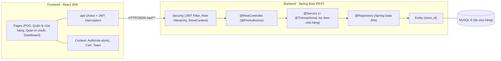
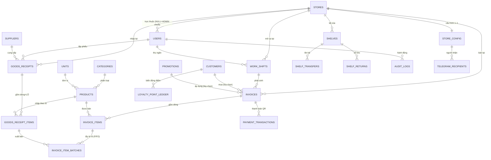
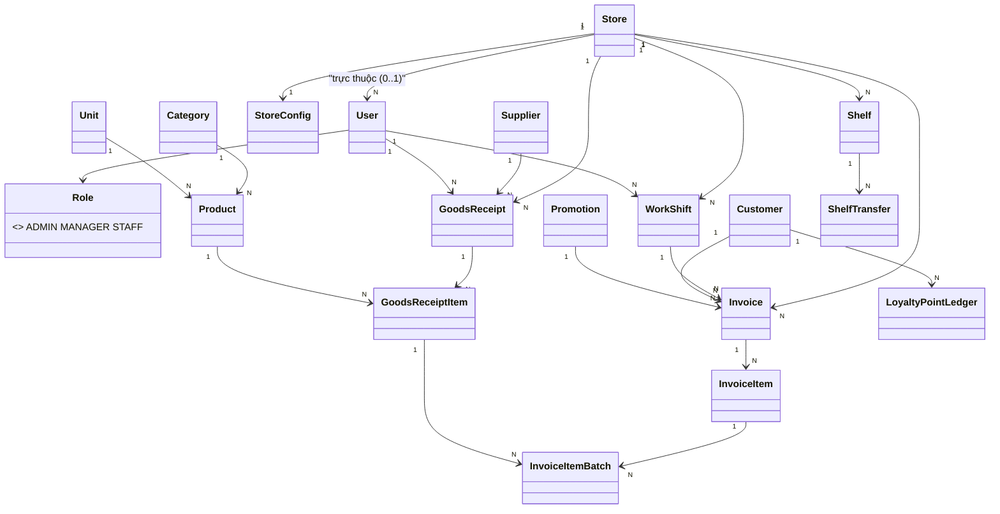

# BÁO CÁO ĐỒ ÁN — WEBSITE POS QUẢN LÝ CHUỖI CỬA HÀNG TIỆN LỢI

> **Đề tài** — Hệ thống POS (Point of Sale) cho **chuỗi cửa hàng tiện lợi đa cửa hàng** (MiniMart POS).
> Đồ án **cá nhân**: phân tích → thiết kế → lập trình (Frontend React + Backend Spring Boot REST + MySQL)
> → kiểm thử → triển khai.
> **Đây là tài liệu thiết kế CHÍNH THỨC** (đã cập nhật theo kiến trúc đa cửa hàng mới nhất).

---

## MỤC LỤC
1. [Tổng quan & bài toán](#1-tổng-quan--bài-toán)
2. [Công nghệ sử dụng](#2-công-nghệ-sử-dụng)
3. [Phân tích yêu cầu (SRS)](#3-phân-tích-yêu-cầu-srs)
4. [Use Case](#4-use-case)
5. [Thiết kế kiến trúc](#5-thiết-kế-kiến-trúc)
6. [Mô hình ĐA CỬA HÀNG (multi-store)](#6-mô-hình-đa-cửa-hàng-multi-store)
7. [Thiết kế cơ sở dữ liệu (ERD)](#7-thiết-kế-cơ-sở-dữ-liệu-erd)
8. [Thiết kế UML](#8-thiết-kế-uml)
9. [Phân quyền theo vai trò (3 tầng)](#9-phân-quyền-theo-vai-trò-3-tầng)
10. [Đặc tả REST API](#10-đặc-tả-rest-api)
11. [Nghiệp vụ chi tiết & tính năng nâng cao](#11-nghiệp-vụ-chi-tiết--tính-năng-nâng-cao)
12. [Toàn vẹn dữ liệu, cô lập & bài toán logic/toán](#12-toàn-vẹn-dữ-liệu-cô-lập--bài-toán-logictoán)
13. [Bảo mật](#13-bảo-mật)
14. [Triển khai & demo](#14-triển-khai--demo)
15. [Kiểm thử (QA)](#15-kiểm-thử-qa)
16. [Kết luận & hướng phát triển](#16-kết-luận--hướng-phát-triển)

---

## 1. Tổng quan & bài toán

Một **chuỗi cửa hàng tiện lợi** có **nhiều cửa hàng**, mỗi cửa hàng có **số mặt hàng lớn**, **tần suất giao dịch cao**,
nhiều hàng có **hạn sử dụng (HSD)**, nhiều **ca/nhân viên** trong ngày. Quản lý thủ công (sổ sách/Excel) gây:
tính tiền chậm & dễ sai, không nắm **tồn kho thực của từng cửa hàng**, dễ tồn hàng cận/quá hạn, khó **tổng hợp
doanh thu toàn chuỗi và so từng cửa hàng**, không quản lý được **khách thân thiết** dùng chung.

**Mục tiêu:** website POS giúp **nhân viên** bán hàng nhanh bằng quét mã vạch (tự tính tiền – tồn kho – hóa đơn);
giúp **quản lý cửa hàng** kiểm soát kho/doanh thu/ca của cửa hàng mình; giúp **quản trị viên toàn chuỗi**
điều hành nhiều cửa hàng, danh mục/giá dùng chung, và xem báo cáo hợp nhất — theo thời gian thực.

| Mục | Nội dung |
|---|---|
| Tên hệ thống | Website POS quản lý chuỗi cửa hàng tiện lợi (MiniMart POS) |
| Kiến trúc | Client–Server tách lớp: **React SPA ↔ REST API (Spring Boot) ↔ MySQL** |
| Quy mô | **Đa cửa hàng (multi-store)** — N cửa hàng, mỗi cửa hàng N quản lý + N nhân viên |
| Hình thức | Đồ án cá nhân — toàn bộ FE + BE + CSDL + tài liệu |

**Phạm vi (trong phạm vi):** quản lý **chuỗi nhiều cửa hàng**; bán hàng quầy (POS) + quét mã vạch; danh mục/sản
phẩm/đơn vị/NCC **dùng chung toàn chuỗi**; nhập kho theo từng cửa hàng; **kho ↔ kệ** (lên kệ/về kho) theo cửa
hàng; tồn kho + cảnh báo HSD **theo cửa hàng**; hóa đơn; khách thân thiết + tích điểm **dùng chung**; khuyến mãi;
VAT; ca làm việc; **phân quyền 3 tầng**; dashboard/báo cáo (gộp chuỗi & theo cửa hàng); cấu hình **riêng từng cửa
hàng** (ngân hàng/VietQR/WEB2M/Telegram); tích hợp QR/PDF/Telegram.

**Ngoài phạm vi:** bán online/giao hàng, kế toán công nợ chi tiết, điều chuyển hàng nội bộ giữa các cửa hàng (kho
trung tâm), trả hàng/hoàn tiền (cửa hàng tiện lợi không nhận trả — sai sót xử lý bằng **hủy hóa đơn**).

---

## 2. Công nghệ sử dụng

| Tầng | Công nghệ |
|---|---|
| Frontend | **React 19 (Vite, Bun)**, React Router, React-Bootstrap, **Recharts**, Axios, Context API |
| Backend | **Java 17, Spring Boot** (Web, Data JPA, Security), JWT, BCrypt, Bean Validation, **Role Hierarchy** |
| CSDL | **MySQL 8** (ServBay/phpMyAdmin), JPA/Hibernate |
| Tích hợp | **VietQR** (hiển thị QR), **WEB2M** (đối soát ngân hàng theo cửa hàng), **Telegram Bot** (theo cửa hàng), **OpenPDF** (hóa đơn 80mm), **Apache POI** (Excel) |
| Khác | Maven, Git (commit theo từng chức năng) |

Backend phân lớp **Controller → Service → Repository → Entity**; Frontend SPA gọi REST `/api/**` qua Axios + JWT.

---

## 3. Phân tích yêu cầu (SRS)

### 3.1. Tác nhân (Actor) — mô hình 3 tầng

| Actor | Phạm vi | Vai trò |
|---|---|---|
| **Quản trị viên (ADMIN)** | TOÀN CHUỖI (không thuộc cửa hàng nào) | Quản lý cửa hàng (chi nhánh), tài khoản, **danh mục/giá/khuyến mãi/NCC dùng chung (HQ)**, cấu hình từng cửa hàng, báo cáo hợp nhất, nhật ký kiểm toán |
| **Quản lý cửa hàng (MANAGER)** | MỘT cửa hàng (N người/cửa hàng) | Vận hành cửa hàng mình: nhập kho, kệ, tồn kho, ca, POS, hủy hóa đơn, báo cáo cửa hàng |
| **Nhân viên (STAFF)** | MỘT cửa hàng (N người/cửa hàng) | Bán hàng POS, ca của mình, khách hàng, lên kệ/về kho |
| **Hệ thống (System)** | Toàn chuỗi | Cảnh báo tồn/HSD theo cửa hàng, đối soát WEB2M theo cửa hàng, Telegram, tích điểm, sinh mã |

> Phân tầng quyền **ADMIN ⊃ MANAGER ⊃ STAFF** (quyền cao bao hàm quyền thấp) — cài bằng Spring Role Hierarchy.
> Khách mua hàng không trực tiếp dùng hệ thống (giao dịch qua nhân viên) → không phải actor đăng nhập.

### 3.2. Yêu cầu chức năng (FR)

- **FR1 Xác thực & phân quyền:** đăng nhập (mật khẩu băm); **3 vai trò ADMIN/MANAGER/STAFF**; ADMIN quản lý tài khoản & **gán mỗi người vào một cửa hàng**; **cửa hàng đóng ⇒ nhân viên cửa hàng đó không đăng nhập được**.
- **FR2 Quản lý chuỗi cửa hàng (MỚI):** ADMIN CRUD cửa hàng (mã, tên, địa chỉ, trạng thái hoạt động); mỗi cửa hàng có cấu hình & tồn kho & nhân sự riêng.
- **FR3 Danh mục & sản phẩm (HQ — dùng chung):** CRUD danh mục/đơn vị/sản phẩm (barcode, giá vốn/bán, **thuế suất**, **quy cách đóng gói**, tồn tối thiểu) — **chỉ ADMIN** chỉnh sửa; quản lý/nhân viên chỉ đọc để nhập/bán.
- **FR4 Nhà cung cấp & nhập kho:** NCC dùng chung (ADMIN quản lý); phiếu nhập **gắn cửa hàng**, nhiều dòng theo lô (số lượng, giá nhập, HSD, **quy đổi thùng**); lô **thừa hưởng cửa hàng** từ phiếu nhập; tự tăng tồn cửa hàng.
- **FR5 Bán hàng POS (trọng tâm):** mở/đóng ca **theo cửa hàng**; quét mã vạch; giỏ hàng; gắn khách + áp KM + đổi điểm; thanh toán tiền mặt/QR; lưu hóa đơn (transaction) gắn cửa hàng, trừ tồn **FIFO theo HSD** *chỉ trong lô của cửa hàng đó*, tích điểm; in PDF.
- **FR6 Hóa đơn & lịch sử:** xem/lọc **theo cửa hàng**; nhân viên chỉ xem HĐ của ca mình; hủy hóa đơn (có lý do, MANAGER/ADMIN) → tồn tự hoàn.
- **FR7 Khách thân thiết (dùng chung toàn chuỗi):** CRUD; tích/đổi điểm; **sổ cái điểm**; lịch sử mua ở mọi cửa hàng.
- **FR8 Khuyến mãi (HQ — dùng chung):** ADMIN CRUD; kiểm tra hợp lệ khi áp dụng tại mọi cửa hàng.
- **FR9 Kho & kệ (theo cửa hàng):** tồn tách **KHO/KỆ** theo cửa hàng; **lên kệ / về kho**; **cấu hình kệ vật lý** (mã kệ duy nhất trong cửa hàng); cảnh báo tồn thấp & HSD; **đề xuất nhập hàng**; **ABC/XYZ** theo cửa hàng.
- **FR10 Dashboard & báo cáo:** KPI + biểu đồ; doanh thu/lợi nhuận theo ngày/tuần/tháng/năm; **MANAGER xem cửa hàng mình, ADMIN xem GỘP toàn chuỗi**; xuất Excel.
- **FR11 Cấu hình theo cửa hàng:** ADMIN chọn cửa hàng để cấu hình thông tin in hóa đơn, ngân hàng/VietQR, WEB2M, Telegram — **riêng từng cửa hàng**.
- **FR-A Nâng cao:** VietQR, đối soát WEB2M (job nền, theo cấu hình từng cửa hàng), Telegram theo cửa hàng, PDF, VAT, audit log, idempotency.

### 3.3. Yêu cầu phi chức năng (NFR)

| Mã | Yêu cầu |
|---|---|
| NFR1 Hiệu năng | Tra mã vạch < 1s; index theo `store_id` cho truy vấn theo cửa hàng |
| NFR2 Khả dụng | POS tối giản, thao tác bằng phím/máy quét; ADMIN không phải "chọn cửa hàng làm việc" |
| NFR3 Tương thích | Responsive (Chrome/Edge, tablet) |
| NFR4 Bảo mật | BCrypt + JWT, **phân quyền 3 tầng backend**, **cô lập dữ liệu giữa cửa hàng**, CORS, chống brute-force, audit |
| NFR5 Toàn vẹn | FK/CHECK/UNIQUE; transaction; **khóa bi quan** chống bán âm; idempotency; `store_id` NOT NULL |
| NFR6 Tin cậy | Validate 2 phía; thông báo lỗi rõ; ẩn lỗi nội bộ |
| NFR7 Bảo trì | Phân lớp rõ, đặt tên thống nhất, component dùng chung |
| NFR8 Triển khai | **Tự tạo + seed CSDL** (2 cửa hàng demo) khi khởi động; chạy đơn giản |

---

## 4. Use Case

Các nhóm use case chính: UC01 Đăng nhập · UC02 Quản lý tài khoản (gán cửa hàng) · **UC03 Quản lý chuỗi cửa hàng** ·
UC04–07 CRUD danh mục/đơn vị/sản phẩm/NCC (HQ) · UC08 Nhập kho (theo cửa hàng) · UC09 Mở/đóng ca ·
**UC10 Bán hàng** · **UC11 Thanh toán & lập hóa đơn** · UC12 Áp khuyến mãi · UC13 In hóa đơn PDF ·
UC14 Quản lý hóa đơn · UC15 Hủy hóa đơn · UC16 Khách thân thiết · UC17 Khuyến mãi (HQ) · UC18 Tồn kho & cảnh báo
(theo cửa hàng) · UC19 Dashboard · UC20 Báo cáo · **UC21 Cấu hình theo cửa hàng** · UC22 QR · UC23 Đối soát WEB2M ·
UC24 Telegram · UC25 Lên kệ/Về kho · UC26 Cấu hình kệ · UC27 Phân tích ABC/XYZ · UC28 Xem nhật ký kiểm toán.

**Quan hệ kế thừa actor:** ADMIN ⊃ MANAGER ⊃ STAFF.

### UC03 — Quản lý chuỗi cửa hàng (ADMIN)
- **Luồng:** tạo/sửa cửa hàng (mã CHxx, tên, địa chỉ, trạng thái). **Đóng cửa hàng** (INACTIVE) ⇒ nhân viên/quản lý
  của cửa hàng đó không đăng nhập được nữa (token cũ tự vô hiệu); mở lại (ACTIVE) ⇒ vào được.

### UC10 — Bán hàng tại quầy
- **Tiền điều kiện:** đã đăng nhập (MANAGER/STAFF của một cửa hàng đang hoạt động) + **đã mở ca**.
- **Luồng chính:** mở POS → quét mã vạch → kiểm tra **tồn trên kệ của cửa hàng** → thêm giỏ + tính tổng →
  (tùy chọn) gắn khách/KM → thanh toán.
- **Ngoại lệ:** không thấy mã → báo; **hết hàng trên kệ của cửa hàng** → "cần lên hàng từ kho".

### UC11 — Thanh toán & lập hóa đơn
- **Hậu điều kiện:** hóa đơn lưu (gắn cửa hàng của ca); tồn kệ cửa hàng giảm; điểm khách tăng.
- **Luồng:** chọn thanh toán → tiền mặt (nhập tiền khách → tính thừa) / QR (sinh VietQR từ cấu hình cửa hàng) →
  **transaction** lưu HĐ + chi tiết + phân bổ lô FIFO **của cửa hàng** + tích điểm + tăng lượt KM. Thiếu tồn → **rollback**.

---

## 5. Thiết kế kiến trúc



| Lớp | Trách nhiệm |
|---|---|
| Controller (`@RestController`) | Nhận request, `@PreAuthorize` theo vai trò, validate (`@Valid`), trả JSON `{success, message, data}` |
| Security/`StoreContext` | Xác thực JWT, phân tầng vai trò, **suy ra cửa hàng hiệu lực** cho mỗi request |
| Service (`@Service`, `@Transactional`) | Nghiệp vụ + giao dịch + **lọc/chốt theo cửa hàng** + chặn truy cập chéo |
| Repository (Spring Data JPA) | Truy xuất CSDL, truy vấn lọc theo `store_id` |
| Entity | Ánh xạ bảng (kèm `store_id`) |

---

## 6. Mô hình ĐA CỬA HÀNG (multi-store)

Đây là phần cốt lõi của thiết kế. Nguyên tắc: **gắn cửa hàng tối thiểu, thừa hưởng tối đa, dùng chung hợp lý.**

### 6.1. Gắn `store_id` TRỰC TIẾP (dữ liệu vận hành riêng từng cửa hàng)
`users` (chi nhánh trực thuộc), `goods_receipts`, `work_shifts`, `shelves`, `invoices`, và `store_config`
(1–1 theo cửa hàng). Cột `store_id` để **NOT NULL** ở bảng vận hành (riêng `users` cho phép NULL cho ADMIN toàn chuỗi).

### 6.2. THỪA HƯỞNG cửa hàng (không thêm cột)
LÔ hàng (`goods_receipt_items`) thừa hưởng cửa hàng từ phiếu nhập; dòng bán & phân bổ lô (`invoice_items`,
`invoice_item_batches`) qua hóa đơn; điều chuyển/trả kệ (`shelf_transfers`, `shelf_returns`) qua kệ. Nhờ vậy
**tồn kho từng cửa hàng vẫn suy ra hoàn toàn từ chứng từ** qua view (thêm chiều `store_id`) — không thêm cột tồn.

### 6.3. DÙNG CHUNG toàn chuỗi
`products`, `categories`, `units`, `suppliers`, `promotions`, `customers`, `loyalty_point_ledger`
(một catalog/bảng giá, một chương trình khách thân thiết & điểm cho cả chuỗi). **Chỉ ADMIN (HQ) được sửa**
catalog/giá/khuyến mãi/NCC; cửa hàng chỉ đọc để nhập & bán.

### 6.4. Suy ra & cô lập "cửa hàng hiệu lực" (`StoreContext`)
- **MANAGER/STAFF**: cửa hàng = cửa hàng trong token (cố định) — không thể tự đổi.
- **ADMIN**: không gắn cửa hàng → **mặc định toàn chuỗi** (báo cáo gộp). Cấu hình theo cửa hàng thì ADMIN
  **chọn cửa hàng tường minh** (tham số `storeId`) ngay trên trang Cấu hình — *không có khái niệm "cửa hàng đang làm việc"*.
- **Chặn truy cập chéo cửa hàng (`assertSameStore`)**: mọi thao tác tra theo id (hóa đơn, ca, phiếu nhập, kệ, thanh
  toán) đều kiểm tra bản ghi thuộc đúng cửa hàng hiệu lực → ngăn IDOR giữa các cửa hàng.

---

## 7. Thiết kế cơ sở dữ liệu (ERD)

> Chuẩn hóa **3NF**, toàn vẹn tham chiếu đầy đủ, **không cột tồn kho dư thừa** (tồn suy ra qua VIEW).
> Hiện có **22 bảng + 6 view**. Script DDL + dữ liệu mẫu: [`../sql/schema.sql`](../sql/schema.sql) (cài tay) và
> [`../backend/src/main/resources/db/schema.sql`](../backend/src/main/resources/db/schema.sql) (tự chạy khi khởi
> động — idempotent: `CREATE TABLE IF NOT EXISTS` + migration kiểm tra `information_schema`, kèm chuyển đổi dữ liệu cũ).

### 7.1. Nguyên tắc thiết kế
- Khóa chính `id BIGINT AUTO_INCREMENT`; tên `snake_case` số nhiều; FK = `<bảng>_id`, ràng buộc `fk_<bảng>_<đích>`.
- Tiền tệ `DECIMAL(12,2)`/`DECIMAL(14,2)`; trạng thái dùng `ENUM`; `CHECK` số/giá ≥ 0; `utf8mb4`.
- **UNIQUE đúng phạm vi đa cửa hàng:** `stores.code`; **mã kệ duy nhất TRONG một cửa hàng** `UNIQUE(store_id, code)`;
  Telegram `UNIQUE(config_id, chat_id)`; `invoices.code`, `idempotency_key`, `products.barcode`, `customers.phone`.
- **Chống dư thừa:** không lưu `current_stock`/`total_spent`/`total_sales` → VIEW; dòng phiếu nhập đóng vai trò **lô**;
  `total_amount`, `subtotal` là cột **GENERATED** (DB tự tính, không lệch).
- **Index đa cửa hàng:** `idx_invoice_store(store_id,status,created_at)`, `idx_*_store` cho goods_receipts/work_shifts/shelves.

### 7.2. Sơ đồ ERD (rút gọn, có cửa hàng)



### 7.3. Danh sách 22 bảng

**Chuỗi & người dùng:**
- `stores` (MỚI): `code` (UK, CH01…), `name`, `address`, `phone`, `status` (ACTIVE/INACTIVE).
- `users`: `username` (UK), `password_hash`, `full_name`, **`role` ENUM(ADMIN, MANAGER, STAFF)**, **`store_id`** (FK stores, NULL=ADMIN toàn chuỗi), `status`.

**Danh mục dùng chung (HQ):** `categories`, `units`, `suppliers`, `customers` (SĐT unique, `loyalty_points`),
`promotions` (mã, loại %/tiền, hiệu lực, lượt dùng).

**Sản phẩm & nhập kho:**
- `products`: barcode (UK), tên, category_id, unit_id, cost_price, sale_price (**đã gồm VAT**), **`tax_rate`**, **`pack_size`** + **`pack_unit_id`**, min_stock, status.
- `goods_receipts`: phiếu nhập — `code` (UK), **`store_id`** (cửa hàng nhập), supplier_id, created_by, total_amount, note.
- `goods_receipt_items` = **LÔ HÀNG** (bất biến): receipt_id, product_id, quantity, import_price, **expiry_date**. *Cửa hàng của lô thừa hưởng từ phiếu.*

**Kho ↔ kệ (theo cửa hàng):**
- `shelves`: **`store_id`**, `code` (**UNIQUE(store_id, code)**), name, **`capacity`**, status.
- `shelf_transfers` / `shelf_returns`: lên kệ / về kho — batch_id, shelf_id, quantity, created_by.

**Bán hàng:**
- `work_shifts`: **`store_id`**, user_id, opening_cash, closing_cash, opened_at, closed_at, status.
- `invoices`: code (UK), **`store_id`** (chốt từ ca), shift_id, customer_id?, promotion_id?, subtotal, discount_amount, `total_amount` **GENERATED**, payment_method (CASH/QR), customer_paid, change_amount, points_earned/used, status (COMPLETED/CANCELLED/PENDING_PAYMENT), **`tax_amount`**, **`idempotency_key`** (UK), cancel audit.
- `invoice_items`: invoice_id, product_id, quantity, unit_price (snapshot), `subtotal` GENERATED.
- `invoice_item_batches` (bảng nối bán ↔ lô): invoice_item_id, batch_id, quantity → trừ tồn FIFO truy vết; **hủy HĐ ⇒ tồn tự hoàn**.

**Thanh toán, cấu hình, kiểm toán, điểm:**
- `payment_transactions`: QR — invoice_id, amount, transfer_content (UK), status, bank_reference, paid_at, expired_at.
- `store_config`: **1 dòng / cửa hàng** (`id` = `stores.id`) — thông tin cửa hàng + ngân hàng (BIN/STK) + WEB2M + Telegram + bật/tắt thông báo.
- `telegram_recipients`: Chat ID nhận thông báo **theo cửa hàng** (`config_id` = stores.id).
- `audit_logs`: nhật ký append-only — actor, action, target, detail, created_at.
- `loyalty_point_ledger`: sổ cái điểm — customer_id, invoice_id?, delta, reason (EARN/REDEEM/CANCEL_REVERSAL), balance_after.

### 7.4. View (6 — suy ra tồn & các tổng, có chiều cửa hàng)

| View | Nội dung |
|---|---|
| `v_batch_stock` | Tồn **từng lô** tách KHO/KỆ, **kèm `store_id`** (thừa hưởng từ phiếu nhập): `on_shelf` = (lên kệ − về kho) − đã bán; `in_warehouse` = nhập − (lên kệ − về kho). HĐ CANCELLED không tính (tồn tự hoàn). |
| `v_product_stock` | Tồn từng SP **theo cửa hàng** (grain = product_id × store_id): tổng + `shelf_stock`/`warehouse_stock` |
| `v_expiring_batches` | Lô còn hàng & HSD ≤ 30 ngày (kèm `store_id`) |
| `v_customer_spending` | Tổng chi tiêu + số HĐ của khách (toàn chuỗi — khách dùng chung) |
| `v_shift_summary` | Doanh thu + số HĐ theo ca (kèm `store_id`) |
| `v_pending_payments` | Giao dịch QR đang chờ WEB2M |

### 7.5. Toàn vẹn giao dịch (NFR5)
- **Bán hàng:** transaction lưu HĐ + chi tiết, chọn lô FIFO/HSD **của cửa hàng** ghi `invoice_item_batches`, cộng điểm,
  tăng `used_count`; thiếu tồn → **rollback**. **Khóa bi quan** theo sản phẩm chống bán âm khi đồng thời.
- **Hủy HĐ:** `status='CANCELLED'` ⇒ tồn **tự hoàn** (view bỏ HĐ CANCELLED), hoàn điểm + lượt KM.
- **Nhập kho / Lên kệ / Về kho:** đều trong transaction, gắn/thừa hưởng cửa hàng.

---

## 8. Thiết kế UML

### 8.1. Class Diagram (domain — rút gọn, có Store & Role)



### 8.2. Sequence — Bán hàng & thanh toán (UC10/UC11), phạm vi cửa hàng

```mermaid
sequenceDiagram
    actor C as Nhân viên (cửa hàng A)
    participant FE as React (POS)
    participant API as InvoiceController
    participant SVC as SaleService
    participant DB as MySQL
    C->>FE: Quét mã vạch
    FE->>API: GET /products/barcode/{code}
    API-->>FE: SP + tồn KỆ (cửa hàng A)
    C->>FE: Thanh toán (idempotencyKey)
    FE->>API: POST /invoices {items, payment, idempotencyKey}
    API->>SVC: createInvoice()
    Note over SVC,DB: @Transactional + khóa SP + cửa hàng = ca.store
    SVC->>DB: chọn lô FIFO/HSD CHỈ của cửa hàng A; INSERT invoice(store_id=A)+items; tích điểm
    alt Đủ tồn kệ cửa hàng A
        SVC-->>API: Invoice
        API-->>FE: 201 {invoice, change, VAT}
    else Thiếu tồn kệ
        SVC->>DB: ROLLBACK
        API-->>FE: 409 "cần lên hàng từ kho"
    end
```

### 8.3. Activity — Luồng bán hàng
Đăng nhập (cửa hàng đang hoạt động) → mở ca → quét mã → (thấy SP? còn tồn kệ cửa hàng?) → thêm giỏ →
(gắn khách/KM) → chọn thanh toán → tiền mặt (đủ tiền? → tiền thừa)/QR (VietQR theo cấu hình cửa hàng) →
**transaction** (lưu HĐ gắn cửa hàng, trừ tồn FIFO của cửa hàng, tích điểm) → in PDF.

---

## 9. Phân quyền theo vai trò (3 tầng)

**Cơ chế 2 lớp + phân tầng:** Frontend (`navConfig.roles`, `PrivateRoute`, `hasRole`) chỉ để **trải nghiệm**;
Backend (`@PreAuthorize` + JWT + **Role Hierarchy ADMIN>MANAGER>STAFF**) mới là **bảo mật thật**.
Ngoài ra mọi truy vấn còn **lọc/chặn theo cửa hàng** (`StoreContext`).

| Nhóm chức năng | ADMIN (chuỗi) | MANAGER (cửa hàng) | STAFF (nhân viên) |
|---|:-:|:-:|:-:|
| Đăng nhập, POS bán hàng, mở/đóng ca của mình | ✅¹ | ✅ | ✅ |
| Xem/in hóa đơn (nhân viên: ca của mình) | ✅ (gộp) | ✅ (cửa hàng) | ✅ (của mình) |
| **Hủy hóa đơn** (bắt buộc lý do, audit) | ✅ | ✅ | ❌ |
| Khách hàng (dùng chung): xem/thêm | ✅ | ✅ | ✅ |
| **Kệ: xem/lên kệ/về kho** (hằng ngày) | — | ✅ | ✅ |
| **Cấu hình kệ**, nhập kho, tồn kho, ABC/XYZ (theo cửa hàng) | — | ✅ | ❌ |
| Dashboard, Báo cáo | ✅ (toàn chuỗi) | ✅ (cửa hàng) | ❌ |
| **Sản phẩm/danh mục/đơn vị/NCC/khuyến mãi (HQ — dùng chung)** | ✅ (sửa) | đọc | đọc |
| **Quản lý CHUỖI CỬA HÀNG** (CRUD cửa hàng) | ✅ | ❌ | ❌ |
| Tài khoản người dùng (gán cửa hàng), Cấu hình theo cửa hàng, Nhật ký kiểm toán | ✅ | ❌ | ❌ |

> ¹ ADMIN có quyền bán nhưng không phải việc của họ (không gắn cửa hàng) → menu vận hành ẩn với ADMIN.
> **HQ vs cửa hàng:** danh mục/giá/khuyến mãi/NCC là dữ liệu **dùng chung toàn chuỗi** nên **chỉ ADMIN sửa** —
> quản lý cửa hàng không thể đổi giá/xoá sản phẩm ảnh hưởng cửa hàng khác (cô lập đúng nghiệp vụ chuỗi).
> **Cửa hàng đóng** ⇒ MANAGER/STAFF của cửa hàng đó **không đăng nhập được** (xác thực kiểm tra trạng thái cửa hàng).

---

## 10. Đặc tả REST API

> Tiền tố `/api`, trả JSON `{success, message, data, timestamp}`. JWT ở header `Authorization: Bearer`
> (trừ `/auth/login`). POST tạo tài nguyên trả **201**. Quyền: A=ADMIN, M=MANAGER, S=STAFF.

| Nhóm | Endpoint tiêu biểu | Quyền |
|---|---|:-:|
| Auth | `POST /auth/login` (trả role+storeId+storeName), `GET /auth/me`, `POST /auth/logout` | tất cả |
| **Chuỗi cửa hàng** | `GET/POST/PUT /stores` | **A** |
| Tài khoản | `GET/POST/PUT/DELETE /users` (gán storeId theo vai trò), `PUT /users/{id}/reset-password` | A |
| SP/DM/ĐV/KM/NCC (HQ) | `GET …`; `POST/PUT/DELETE /products` `/categories` `/units` `/promotions` `/suppliers` | **A** (GET: M/S) |
| Nhập kho (cửa hàng) | `GET/POST /goods-receipts` | M |
| **Kệ** | `GET /shelves`, `GET /shelves/{id}/inventory`, `POST /shelves/transfer`, `POST /shelves/return` | M/S |
| Cấu hình kệ | `POST/PUT/DELETE /shelves` | M |
| Ca/Bán hàng | `POST /shifts/open`, `POST /shifts/{id}/close`, `GET /shifts/current`, `POST /invoices`, `GET /invoices`, `POST /invoices/{id}/cancel`, `GET /invoices/{id}/pdf` | M/S (cancel: M) |
| Khách/KM | `GET/POST/PUT/DELETE /customers`, `GET /customers/{id}/history`, `GET /promotions`, `POST /promotions/validate` | xem: M/S; sửa khách: M |
| Kho/BC (theo cửa hàng / gộp) | `GET /inventory/stock` `/low-stock` `/expiring` `/suggestions` `/abc-xyz`, `GET /dashboard`, `GET /reports/revenue` `/reports/export` | A/M |
| Cấu hình theo cửa hàng | `GET/PUT /store-config?storeId=`, `/integrations/**?storeId=` | A |
| Thanh toán | `GET /payments/{id}/status`, `POST /payments/{id}/confirm` | M/S (cùng cửa hàng) |
| Audit | `GET /audit` | A |

---

## 11. Nghiệp vụ chi tiết & tính năng nâng cao

### 11.1. Mô hình tồn kho 2 tầng KHO ↔ KỆ — theo cửa hàng
Hàng nhập vào **kho của cửa hàng**; muốn bán phải **lên kệ**; POS chỉ bán phần **trên kệ của cửa hàng đó**.
Có cả chiều **về kho**. Tồn suy ra qua `v_batch_stock` (chiều `store_id`). FIFO bỏ lô `expiry < hôm nay`
(chặn bán hàng quá HSD) và **chỉ chọn lô của cửa hàng đang bán**.

### 11.2. Cấu hình & tích hợp RIÊNG từng cửa hàng
Mỗi cửa hàng có `store_config` riêng: thông tin in hóa đơn, **tài khoản ngân hàng/VietQR riêng**, **WEB2M riêng**,
**Telegram + danh sách người nhận riêng**. ADMIN chọn cửa hàng để cấu hình. Job đối soát WEB2M **lặp qua từng cửa
hàng** có cấu hình, chỉ khớp giao dịch của hóa đơn thuộc cửa hàng đó.

### 11.3. Thuế GTGT (VAT)
Giá niêm yết **đã gồm VAT**; `thuế = tiền × r/(100+r)`, co giãn theo giảm giá. Hiện trên chi tiết HĐ + dòng VAT trên PDF.

### 11.4. Đơn vị quy đổi thùng ↔ lon
`pack_size` + `pack_unit_id`. Tồn luôn ở đơn vị cơ bản; **quy đổi khi nhập** ⇒ không đụng view tồn.

### 11.5. Nhật ký kiểm toán
`audit_logs` ghi ai/khi nào/lý do cho **hủy HĐ** (bắt buộc lý do ≥3 ký tự), **đổi cấu hình**, **CRUD cửa hàng/tài khoản/kệ/nhập kho**…

### 11.6. Tích hợp QR (VietQR + WEB2M + Telegram) — theo cửa hàng
- **VietQR:** dựng URL ảnh QR từ cấu hình **của cửa hàng bán** (BIN/STK) + số tiền + nội dung CK.
- **WEB2M:** job nền poll lịch sử giao dịch **từng cửa hàng**, khớp số tiền + nội dung CK ⇒ `PENDING→PAID`.
- **Telegram:** gửi thông báo tới người nhận **của cửa hàng** liên quan.
- **PDF:** hóa đơn 80mm theo thông tin **cửa hàng phát sinh hóa đơn**.

### 11.7. Phân tích (theo cửa hàng)
Đề xuất nhập hàng (tồn an toàn theo mức phục vụ), gợi ý mua kèm (lift), ABC/XYZ — tính **theo dữ liệu của cửa hàng**.

---

## 12. Toàn vẹn dữ liệu, cô lập & bài toán logic/toán

| Vấn đề | Giải pháp | Kiểm chứng |
|---|---|---|
| 2 quầy bán đơn vị cuối cùng → tồn âm | **Khóa bi quan** theo sản phẩm (id tăng dần) | 1 OK, 1 Conflict 409, tồn = 0 |
| Mất mạng → bấm lại = 2 hóa đơn | **Idempotency key** UNIQUE → trả HĐ cũ | cùng key → cùng 1 HĐ |
| Bán nhầm hàng quá HSD | FIFO loại lô `expiry < hôm nay` | — |
| **Bán nhầm tồn của cửa hàng khác** | FIFO **chỉ chọn lô của cửa hàng đang bán** (`store_id`) | CH2 tồn=0 không lấy lô CH1 |
| **Xem/sửa dữ liệu cửa hàng khác qua id** | `StoreContext.assertSameStore` ở mọi tra-theo-id | quản lý CH1 đọc ca CH2 → 400 |
| **Quản lý cửa hàng đổi giá/xoá SP của cả chuỗi** | Catalog/giá/KM/NCC **chỉ ADMIN sửa** | manager xoá SP → 403 |
| **Cửa hàng đóng mà nhân viên vẫn vào** | Xác thực kiểm tra **trạng thái cửa hàng** | đóng CH2 → staff2/manager2 401, mở lại → 200 |
| Báo cáo ADMIN vs MANAGER | ADMIN gộp toàn chuỗi (storeId=null), MANAGER theo cửa hàng | mỗi vai trò ra đúng phạm vi |
| Lợi nhuận đổi khi đổi giá vốn | COGS theo **FIFO‑lô** (`import_price` lô đã bán) | — |
| Bấm mở ca 2 lần đồng thời | **Khóa dòng user** trước khi kiểm tra ca | request sau bị 400 |
| Đóng ca khi còn HĐ QR chờ tiền | Chặn đóng ca nếu còn PENDING_PAYMENT | 400 kèm số đơn chờ |

**Mô hình toán:** tồn an toàn `SS = z·σ·√L`, EOQ = √(2DS/H); lift mua kèm `co(A,B)/n(B)`; ABC theo Pareto luỹ kế,
XYZ theo `CV = σ/μ` — **tất cả tính theo từng cửa hàng**.

---

## 13. Bảo mật

| Hạng mục | Giải pháp |
|---|---|
| Mật khẩu | Băm **BCrypt** |
| Xác thực | **JWT** stateless; **fail-fast** nếu dùng JWT secret mặc định ở profile `prod`; **chặn đăng nhập khi cửa hàng đóng** |
| Phân quyền | `@PreAuthorize` + **Role Hierarchy ADMIN>MANAGER>STAFF** (backend) + nav/PrivateRoute (frontend) |
| **Cô lập đa cửa hàng** | `StoreContext` lọc theo cửa hàng + `assertSameStore` chống IDOR chéo cửa hàng; catalog HQ-only |
| Chống brute-force | Khóa tạm 60s sau 5 lần sai (HTTP **429**) |
| Audit | Nhật ký kiểm toán cho thao tác nhạy cảm |
| CORS / SQLi / XSS | Chỉ origin FE; JPA tham số hóa; React auto-escape |
| Rò rỉ lỗi | 500 không lộ chi tiết nội bộ |
| Bí mật | WEB2M/Telegram/JWT secret để **biến môi trường**, không commit |

---

## 14. Triển khai & demo

```bash
# 1) Backend (cổng 8080) — TỰ TẠO + SEED CSDL (2 cửa hàng demo) khi khởi động
cd backend && mvn spring-boot:run
# 2) Frontend (cổng 5173, proxy /api -> 8080)
cd frontend && bun install && bun run dev
# Mở http://localhost:5173
```
- **Tài khoản demo** (mật khẩu `123456`):
  - `admin` — **Quản trị viên toàn chuỗi** (quản lý cửa hàng, tài khoản, catalog, cấu hình, báo cáo gộp).
  - `manager` / `staff` — Quản lý / Nhân viên **Cửa hàng 1 (CH01)**.
  - `manager2` / `staff2` — Quản lý / Nhân viên **Cửa hàng 2 (CH02)**.
- CSDL **tự seed**: 2 cửa hàng, ~130 sản phẩm dùng chung, tồn + kệ + lịch sử bán cho CH01; CH02 để trống minh hoạ cô lập.
- Giá trị nhạy cảm đặt qua **biến môi trường** trong `application.yml`.

---

## 15. Kiểm thử (QA)

| Loại | Phạm vi | Kết quả |
|---|---|---|
| Unit test (JUnit + Mockito) | `PromotionService`, `Money` (VAT/làm tròn), `ShiftResponse` (quỹ ca), `CodeGenerator`, `VietQrUtil` | **27/27 PASS** |
| Tích hợp / End-to-end (API thật trên MySQL) | Đăng nhập 3 vai trò; POS bán → tồn −1 → hủy → hoàn; cô lập CH1/CH2; chặn IDOR chéo cửa hàng; cấu hình riêng từng cửa hàng; **cửa hàng đóng → chặn đăng nhập**; catalog HQ-only | Đạt — kiểm chứng từng assertion |
| Giao diện | Playwright/thao tác tay 3 vai trò | Đạt |

Ví dụ đã kiểm chứng: bán 1 SP (nhân viên CH01) → tồn CH01 −1 → quản lý CH01 hủy → tồn hoàn; CH02 tồn=0 (không lẫn CH1);
quản lý CH1 đọc ca CH2 → **400**; nhân viên hủy HĐ → **403**; đóng CH2 → staff2/manager2 **401**, mở lại → **200**;
manager sửa/xoá catalog → **403**; cấu hình CH01 (MB Bank) ≠ CH02 (Vietcombank).

---

## 16. Kết luận & hướng phát triển

**Đạt được:** hệ thống POS **quản lý chuỗi đa cửa hàng** với **phân quyền 3 tầng ADMIN/MANAGER/STAFF**;
**cô lập dữ liệu giữa các cửa hàng** (tồn/ca/hóa đơn/nhập kho/kệ riêng; chống truy cập chéo); **catalog/giá/khuyến
mãi/NCC dùng chung do HQ quản lý**; **cấu hình & tích hợp (ngân hàng/WEB2M/Telegram) riêng từng cửa hàng**;
**báo cáo hợp nhất toàn chuỗi & theo cửa hàng**; bán hàng FIFO theo HSD trong phạm vi cửa hàng; VAT; khách thân
thiết dùng chung. Kiến trúc React + Spring Boot REST tách lớp; CSDL chuẩn hóa 3NF, toàn vẹn bằng transaction +
khóa bi quan + idempotency + audit; **cửa hàng đóng thì nhân viên không đăng nhập được**.

**Hướng phát triển:** điều chuyển hàng nội bộ giữa các cửa hàng (kho trung tâm + chứng từ xuất/nhận); so sánh hiệu
quả các cửa hàng trên dashboard; giá bán theo vùng/cửa hàng; app di động cho nhân viên; dự báo nhu cầu
(EWMA/Holt-Winters) theo từng cửa hàng; in tem mã vạch; giữ đơn (hold/park).
</content>
