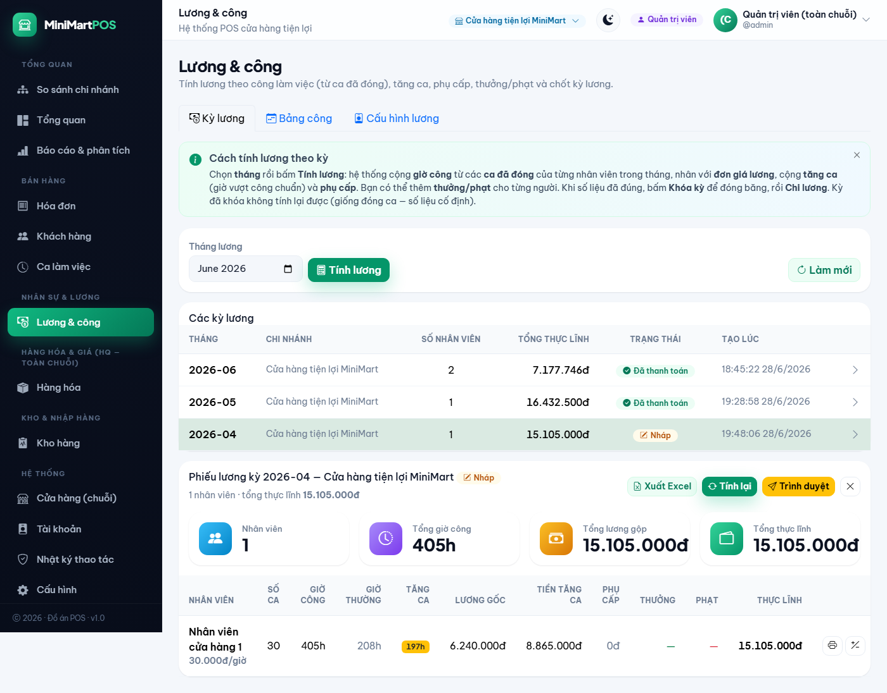
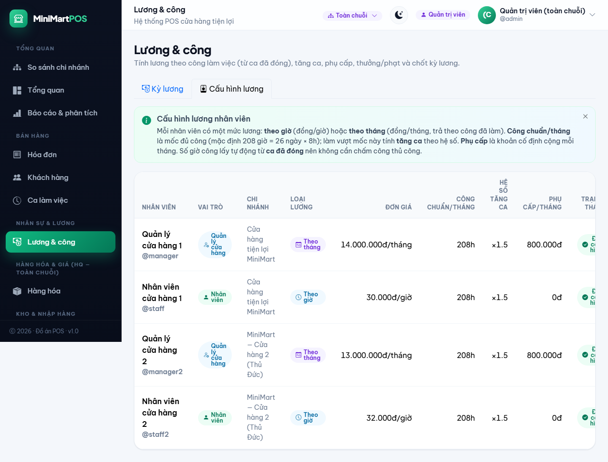
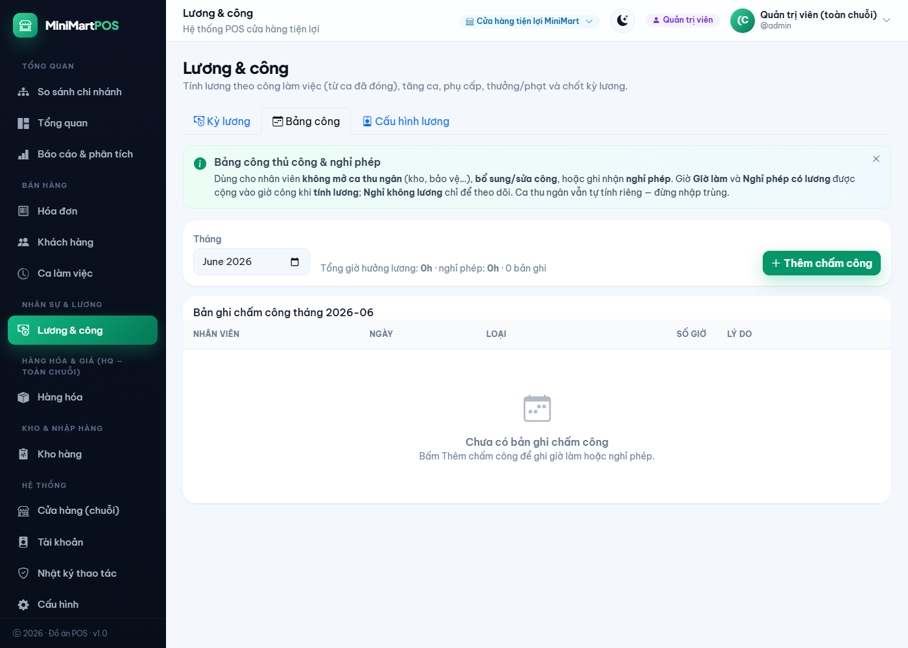
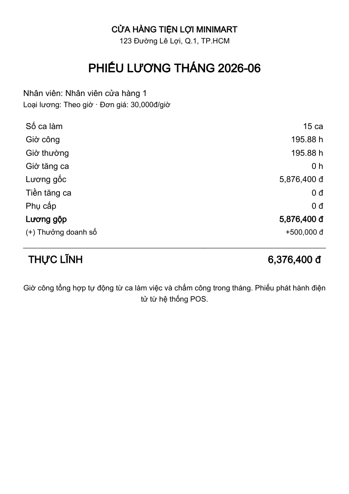
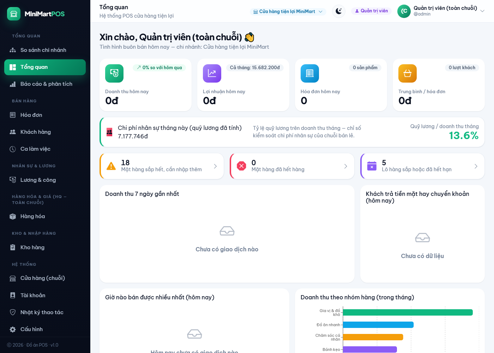

# CHƯƠNG: PHÂN HỆ QUẢN LÝ LƯƠNG & CHẤM CÔNG

## 1. Giới thiệu phân hệ

### 1.1. Đặt vấn đề

Hệ thống POS chuỗi cửa hàng tiện lợi MiniMart đã có phân hệ **Quản lý ca làm việc**: mỗi thu ngân khi bắt đầu làm sẽ *mở ca* (ghi nhận tiền đầu ca) và khi kết thúc thì *đóng ca* (kiểm quỹ). Mỗi ca lưu lại thời điểm mở (`opened_at`) và đóng (`closed_at`), tức là đã có sẵn dữ liệu **thời gian làm việc** của nhân viên.

Tuy nhiên, hệ thống chưa có cơ chế **tính lương**. Việc tính lương thủ công trên giấy/Excel dễ sai sót, khó đối soát, không gắn với dữ liệu chấm công thực tế và không phù hợp với mô hình **đa chi nhánh** (mỗi cửa hàng tự quản lý nhân sự của mình nhưng vẫn chịu sự kiểm soát của quản trị chuỗi).

Phân hệ **Quản lý lương & chấm công** được xây dựng để giải quyết bài toán trên: biến dữ liệu ca làm việc thành **bảng công**, từ đó **tính lương tự động** theo nhiều hình thức trả lương, có quy trình **duyệt** chặt chẽ và khả năng **xuất chứng từ** (bảng lương Excel, phiếu lương PDF).

### 1.2. Mục tiêu

- Tự động tổng hợp **giờ công** của nhân viên từ ca làm việc đã đóng và bảng chấm công thủ công.
- **Tính lương** chính xác theo hai hình thức: lương giờ và lương tháng; có tính tăng ca, phụ cấp, thưởng, phạt.
- Quản lý lương theo **kỳ** (chi nhánh × tháng) với **quy trình duyệt hai bước** bảo đảm tách bạch trách nhiệm.
- **Phân quyền** rõ ràng theo mô hình đa chuỗi: quản trị viên toàn chuỗi, quản lý cửa hàng, nhân viên.
- **Xuất chứng từ**: bảng lương ra Excel, phiếu lương cá nhân ra PDF; **thông báo** qua Telegram khi chốt lương.
- Cung cấp chỉ số **chi phí nhân sự trên doanh thu** trên dashboard để kiểm soát chi phí.

### 1.3. Phạm vi

Phân hệ tập trung vào nghiệp vụ trả lương cho nhân viên cửa hàng. Các nội dung như bảo hiểm xã hội, thuế thu nhập cá nhân, xếp lịch ca tự động nằm ngoài phạm vi bản báo cáo này và được đề xuất ở mục Hướng phát triển.

## 2. Khảo sát & phân tích yêu cầu

### 2.1. Tác nhân và phân quyền

| Tác nhân | Vai trò | Quyền trong phân hệ lương |
|---|---|---|
| Quản trị viên (ADMIN) | Toàn chuỗi, không thuộc chi nhánh nào | Cấu hình lương, tính/duyệt/chi lương cho mọi chi nhánh; là cấp **duyệt** bảng lương |
| Quản lý cửa hàng (MANAGER) | Một chi nhánh | Cấu hình lương, chấm công, tính & **trình duyệt** bảng lương của chính chi nhánh mình |
| Nhân viên (STAFF) | Một chi nhánh | Xem & in **phiếu lương đã chốt của chính mình** |

### 2.2. Yêu cầu chức năng

| Mã | Yêu cầu chức năng |
|---|---|
| FR-L1 | Cấu hình lương cho từng nhân viên (hình thức, đơn giá, công chuẩn, hệ số tăng ca, phụ cấp) |
| FR-L2 | Chấm công thủ công và ghi nhận nghỉ phép (có lương / không lương) |
| FR-L3 | Tổng hợp giờ công tự động từ ca đã đóng cộng với bảng chấm công |
| FR-L4 | Tính lương theo kỳ (chi nhánh × tháng): lương gốc, tăng ca, phụ cấp |
| FR-L5 | Thêm các khoản thưởng / phạt / tạm ứng cho từng phiếu lương |
| FR-L6 | Quy trình duyệt hai bước: trình duyệt → duyệt → chi lương; có thể trả lại bản nháp |
| FR-L7 | Nhân viên xem và in phiếu lương đã chốt của mình |
| FR-L8 | Xuất bảng lương cả kỳ ra Excel; in phiếu lương cá nhân ra PDF |
| FR-L9 | Thông báo qua Telegram tới chi nhánh khi duyệt hoặc chi lương |
| FR-L10 | Hiển thị tỷ lệ chi phí nhân sự (quỹ lương) trên doanh thu ở dashboard |

### 2.3. Yêu cầu phi chức năng

- **Toàn vẹn dữ liệu**: số liệu phiếu lương được *chốt cố định* (snapshot) khi duyệt, không bị thay đổi nếu dữ liệu ca/hóa đơn về sau biến động.
- **Cô lập đa chi nhánh**: mọi truy vấn và thao tác ghi đều bị giới hạn theo chi nhánh của người dùng; chặn truy cập chéo chi nhánh.
- **Khả năng kiểm toán**: mọi thao tác đổi mức lương, trình/duyệt/chi lương đều được ghi nhật ký.
- **Bảo mật**: nhân viên không thể xem phiếu lương của người khác (chống IDOR).

## 3. Thiết kế hệ thống

### 3.1. Mô hình dữ liệu

Phân hệ bổ sung **năm bảng** vào cơ sở dữ liệu (MySQL 8, chuẩn hóa 3NF):

| Bảng | Vai trò |
|---|---|
| `employee_pay_profiles` | Cấu hình lương hiện hành của từng nhân viên (1 dòng / nhân viên) |
| `payroll_periods` | Kỳ lương theo (chi nhánh × tháng); mang trạng thái vòng đời duyệt |
| `payslips` | Phiếu lương (1 / nhân viên / kỳ) — snapshot toàn bộ số liệu công & tiền |
| `payslip_adjustments` | Các dòng thưởng / phạt / tạm ứng gắn vào phiếu lương |
| `attendance_entries` | Bản ghi chấm công thủ công & nghỉ phép (bổ sung công ngoài ca) |

Quan hệ chính: một `payroll_periods` có nhiều `payslips`; một `payslips` có nhiều `payslip_adjustments`. `employee_pay_profiles` và `attendance_entries` tham chiếu tới `users` (nhân viên) và `stores` (chi nhánh).

### 3.2. Mô tả các bảng trọng yếu

**Bảng `employee_pay_profiles`** — cấu hình lương:

| Cột | Kiểu | Ý nghĩa |
|---|---|---|
| user_id | BIGINT (UNIQUE) | Nhân viên |
| pay_type | ENUM(HOURLY, MONTHLY) | Lương theo giờ hay theo tháng |
| base_rate | DECIMAL(12,2) | Đơn giá: đồng/giờ hoặc đồng/tháng |
| standard_monthly_hours | DECIMAL(6,2) | Công chuẩn/tháng (mặc định 208h = 26 ngày × 8h) |
| ot_multiplier | DECIMAL(4,2) | Hệ số tăng ca (mặc định 1.5) |
| monthly_allowance | DECIMAL(12,2) | Phụ cấp cố định / tháng |

**Bảng `payroll_periods`** — kỳ lương với vòng đời duyệt 2 bước:

| Cột | Kiểu | Ý nghĩa |
|---|---|---|
| store_id, period_month | BIGINT, CHAR(7) | Chi nhánh và tháng (YYYY-MM); duy nhất theo cặp |
| status | ENUM | DRAFT, PENDING_APPROVAL, APPROVED, PAID |
| submitted_by / submitted_at | BIGINT / DATETIME | Người và thời điểm trình duyệt |
| approved_by / approved_at | BIGINT / DATETIME | Người và thời điểm duyệt |
| paid_at | DATETIME | Thời điểm chi lương |

**Bảng `attendance_entries`** — chấm công thủ công:

| Cột | Kiểu | Ý nghĩa |
|---|---|---|
| user_id, store_id, work_date | | Nhân viên, chi nhánh, ngày |
| type | ENUM | WORK (giờ làm ngoài ca), LEAVE_PAID (nghỉ có lương), LEAVE_UNPAID (nghỉ không lương) |
| hours | DECIMAL(5,2) | Số giờ (lớn hơn 0, không quá 24) |

### 3.3. Quy trình nghiệp vụ — vòng đời kỳ lương

Kỳ lương đi qua bốn trạng thái theo **quy trình duyệt hai bước**, bảo đảm tách bạch giữa người lập và người duyệt:

> DRAFT (Nháp) → PENDING_APPROVAL (Chờ duyệt) → APPROVED (Đã duyệt) → PAID (Đã chi)

- **DRAFT**: người lập (quản lý cửa hàng hoặc quản trị viên) tính/tính lại lương, thêm thưởng/phạt. Đây là trạng thái duy nhất cho phép thay đổi số liệu.
- **Trình duyệt** (DRAFT → PENDING_APPROVAL): người lập gửi bảng lương đi duyệt; số liệu bị *đóng băng*.
- **Duyệt** (PENDING_APPROVAL → APPROVED): **chỉ quản trị viên** được duyệt, bảo đảm người duyệt khác người lập. Khi duyệt, hệ thống gửi **thông báo Telegram** tới chi nhánh.
- **Trả lại** (PENDING_APPROVAL → DRAFT): quản trị viên không đồng ý, trả về bản nháp kèm lý do để chỉnh sửa.
- **Chi lương** (APPROVED → PAID): ghi nhận đã trả lương, gửi thông báo Telegram.

### 3.4. Công thức tính lương

Với mỗi nhân viên trong một kỳ:

- Giờ công tổng hợp: `worked_hours = Σ(giờ ca đã đóng) + Σ(giờ WORK và LEAVE_PAID trong bảng công)`. Nghỉ không lương (LEAVE_UNPAID) chỉ ghi nhận, không tính tiền.
- Giờ thường và tăng ca: `regular_hours = min(worked_hours, standard)`; `ot_hours = max(0, worked_hours − standard)`.

Lương gốc và tăng ca tùy hình thức trả lương:

- **Lương giờ (HOURLY)**: `regular_pay = regular_hours × base_rate`; `ot_pay = ot_hours × base_rate × ot_multiplier`.
- **Lương tháng (MONTHLY)** — trả theo tỷ lệ công đã làm: `regular_pay = base_rate × (regular_hours / standard)`; `ot_pay = base_rate × ot_hours × ot_multiplier / standard`. Làm đủ công thì hưởng đủ lương tháng; làm thiếu thì bị trừ theo tỷ lệ; làm dư thì phần dư tính tăng ca.

Tổng hợp cho cả hai hình thức:

- `gross_pay = regular_pay + ot_pay + allowance`
- `net_pay = gross_pay + Σ(thưởng) − Σ(phạt)` (thực lĩnh)

### 3.5. Tích hợp đa nguồn chấm công

Điểm thiết kế cốt lõi: giờ công đến từ **hai nguồn** và được cộng gộp khi tính lương:

1. **Ca thu ngân đã đóng** — tự động, dành cho nhân viên bán hàng tại quầy.
2. **Bảng công thủ công** — dành cho nhân viên không mở ca tiền (kho, bảo vệ), cho việc sửa/bổ sung công và ghi nhận nghỉ phép.

Nhờ vậy, một nhân viên chỉ có chấm công thủ công (không có ca) vẫn được tính lương đầy đủ.

## 4. Hiện thực

### 4.1. Công nghệ

| Thành phần | Công nghệ |
|---|---|
| Backend | Java 17, Spring Boot, Spring Data JPA, Spring Security (JWT) |
| Cơ sở dữ liệu | MySQL 8 (utf8mb4) |
| Frontend | React, React-Bootstrap, Axios |
| Xuất chứng từ | Apache POI (Excel), OpenPDF (PDF font Unicode) |
| Thông báo | Telegram Bot API |

### 4.2. Danh sách API

| Phương thức & đường dẫn | Quyền | Chức năng |
|---|---|---|
| GET /api/payroll/pay-profiles | ADMIN, MANAGER | Danh sách cấu hình lương nhân viên |
| PUT /api/payroll/pay-profiles/{userId} | ADMIN, MANAGER | Đặt cấu hình lương |
| GET /api/payroll/attendance?month | ADMIN, MANAGER | Bảng chấm công theo tháng |
| POST /api/payroll/attendance | ADMIN, MANAGER | Thêm bản ghi chấm công |
| DELETE /api/payroll/attendance/{id} | ADMIN, MANAGER | Xóa bản ghi chấm công |
| GET /api/payroll/periods | ADMIN, MANAGER | Danh sách kỳ lương |
| POST /api/payroll/periods/compute | ADMIN, MANAGER | Tạo / tính lại kỳ lương |
| POST /api/payroll/periods/{id}/submit | ADMIN, MANAGER | Trình duyệt |
| POST /api/payroll/periods/{id}/approve | ADMIN | Duyệt |
| POST /api/payroll/periods/{id}/reject | ADMIN | Trả lại bản nháp |
| POST /api/payroll/periods/{id}/pay | ADMIN, MANAGER | Chi lương |
| POST /api/payroll/payslips/{id}/adjustments | ADMIN, MANAGER | Thêm thưởng / phạt |
| GET /api/payroll/periods/{id}/export | ADMIN, MANAGER | Xuất bảng lương Excel |
| GET /api/payroll/payslips/{id}/pdf | Mọi vai trò | In phiếu lương PDF (nhân viên chỉ phiếu của mình) |
| GET /api/payroll/my-payslips | Mọi vai trò | Phiếu lương của tôi |

### 4.3. Giao diện minh họa

Trang **Lương & công** được tổ chức thành ba thẻ: *Kỳ lương*, *Bảng công*, *Cấu hình lương*.

Cấu hình lương cho từng nhân viên (hình thức trả lương, đơn giá, phụ cấp):

Bảng chấm công thủ công và nghỉ phép:

Phiếu lương cá nhân xuất ra PDF (hỗ trợ tiếng Việt):

Chỉ số chi phí nhân sự trên doanh thu ở dashboard:

## 5. Kiểm thử

Phân hệ được kiểm thử đầu-cuối trên hệ thống chạy thật (backend, frontend, cơ sở dữ liệu MySQL), kiểm tra ở cả mức API và mức giao diện.

| # | Kịch bản kiểm thử | Kết quả mong đợi | Kết quả |
|---|---|---|---|
| 1 | Tính lương theo giờ: 195,88h × 30.000đ | Lương gốc 5.876.400đ | Đạt |
| 2 | Tính lương tháng theo tỷ lệ công + phụ cấp | Trả đúng theo công | Đạt |
| 3 | Tăng ca: 405h, công chuẩn 208h | 197h tăng ca × 1.5 | Đạt |
| 4 | Cộng giờ chấm công (WORK + LEAVE_PAID) vào lương | Cộng đúng, loại nghỉ không lương | Đạt |
| 5 | Thêm thưởng 500.000đ → cập nhật thực lĩnh | Thực lĩnh tăng tương ứng | Đạt |
| 6 | Quản lý trình duyệt → chờ duyệt | Trạng thái PENDING_APPROVAL | Đạt |
| 7 | Quản lý tự duyệt | Bị chặn (chỉ ADMIN) | Đạt |
| 8 | Quản trị viên trả lại → nháp → duyệt → chi | Vòng đời đúng | Đạt |
| 9 | Tính lại kỳ đã duyệt | Bị chặn (số liệu cố định) | Đạt |
| 10 | Nhân viên in phiếu của người khác | Bị chặn (chống IDOR) | Đạt |
| 11 | Xuất bảng lương Excel | File hợp lệ, đúng số liệu | Đạt |
| 12 | Dashboard tỷ lệ quỹ lương / doanh thu | Tính đúng phần trăm | Đạt |

## 6. Đánh giá & hướng phát triển

### 6.1. Kết quả đạt được

Phân hệ đã hoàn thành đầy đủ các yêu cầu chức năng đề ra: tính lương tự động đa hình thức từ dữ liệu ca và chấm công, quy trình duyệt hai bước tách bạch trách nhiệm, xuất chứng từ Excel/PDF, thông báo Telegram và chỉ số chi phí nhân sự. Toàn bộ bám sát mô hình đa chi nhánh với phân quyền và cô lập dữ liệu chặt chẽ.

### 6.2. Hướng phát triển

- Tích hợp **bảo hiểm xã hội** (BHXH/BHYT/BHTN) và **thuế thu nhập cá nhân** theo luật Việt Nam.
- **Tăng ca theo luật lao động**: phân biệt ngày thường / cuối tuần / lễ (150% / 200% / 300%) và ca đêm.
- **Xếp lịch ca** và đối chiếu kế hoạch với thực tế.
- Thiết bị **chấm công** thực (vân tay / thẻ từ) đẩy dữ liệu vào bảng chấm công.
</content>
